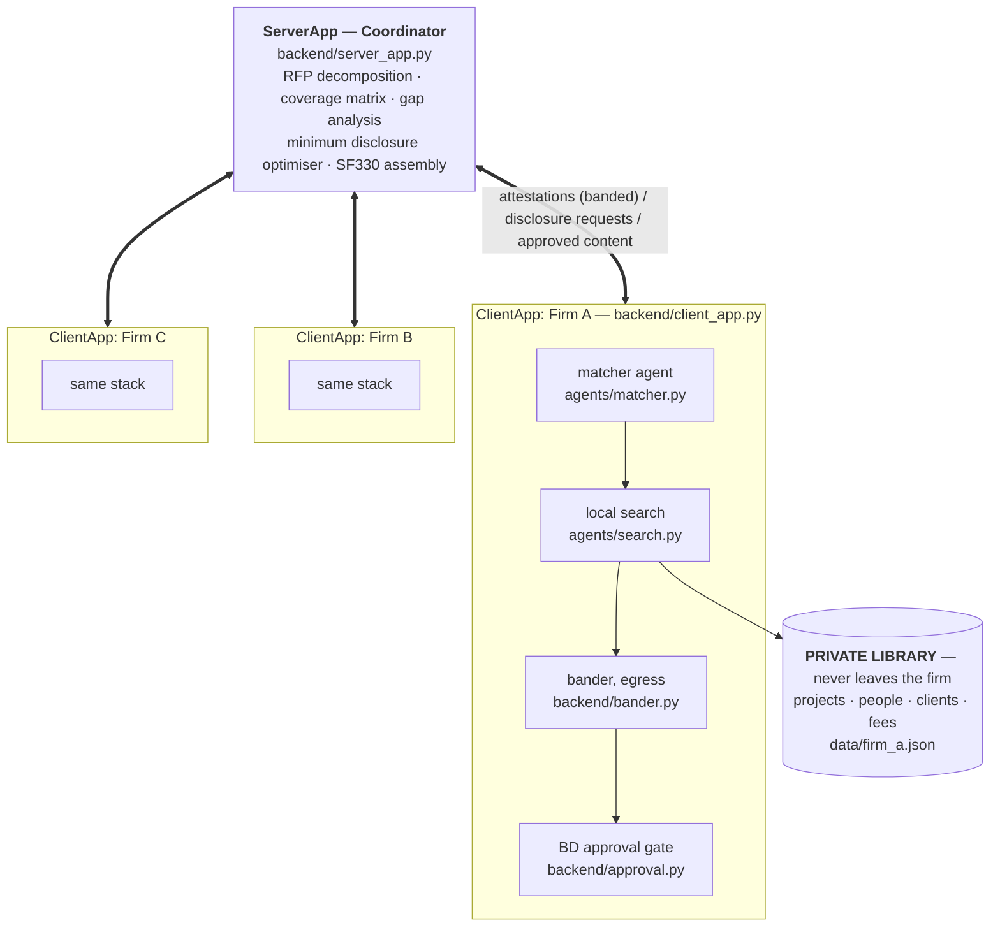

# Consortium — Federated Bid Assembly

**Collaborative Agent Hackathon — Flower Labs, University of Cambridge, Wed 26 Aug 2026**

Domain: AEC qualifications packages (SF330), grounded in the OpenAsset / Axomic workflow.

---

## 1. The pitch

Large federal infrastructure work is bid by **joint ventures**: three or four architecture
and engineering firms partner on a single pursuit, each contributing project qualifications
and key personnel. Those same firms compete against each other on the next three pursuits.

So every JV has an awkward problem. To produce a compliant SF330 the partners must
establish, together, that the team covers every requirement in the solicitation. But a
firm's full project history exposes its client relationships and contract values, and its
full roster is a recruiter's shopping list. Today this is solved by emailing spreadsheets
around and hoping.

Consortium puts an agent next to each firm's private asset library. The agents establish
compliance by exchanging **attestations** — banded, anonymised evidence that a matching
record exists — never the records. A coordinator computes the *minimum set of disclosures*
that makes the bid compliant, each firm's BD lead approves their own releases individually,
and only then does real content flow into the document.

**One-line demo:** *three firms discover their joint bid is non-compliant, fix it, and
assemble the SF330 — while each firm releases three records out of forty and never names
its confidential clients.*

---

## 2. The design constraint

> **No single firm can assess whether the JV is compliant.**

Direct transplant of the principle from the incident-diagnosis design. Each firm sees only
its own coverage, systematically overestimates its contribution, and cannot know which of
its assets are actually load-bearing. The federated coverage matrix is the only artefact
that reveals the true gap.

If any one firm can determine compliance alone, the system did not need to be distributed.
The synthetic corpora are engineered backwards from this.

---

## 3. Why SF330 is the right output

The form is structurally a gift:

| Section | Content | Why it matters here |
|---|---|---|
| **E** | Resumes of key personnel | Your "employee bios" workflow |
| **F** | Example projects — **maximum 10** | Your "project sheets" workflow; the cap forces selection |
| **G** | Matrix: which key person worked on which example project | The join — and the source of the demo moment |

Section G is the crux. It is not enough to have healthcare people and seismic people. The
matrix demands *this named individual, on that named project*. Firms routinely believe they
are covered at the aggregate level and are not covered at the cell level.

The Section F cap of ten projects is what turns disclosure into an optimisation problem
rather than a dump.

---

## 4. The scenario

**Solicitation:** federal healthcare facility, seismic zone, design-build.

**The JV:** Firm A (large multidisciplinary, healthcare-heavy), Firm B (structural
specialist, seismic-heavy), Firm C (mid-size regional, strong federal past performance).

**Requirements (abbreviated):**

| ID | Section | Kind | Predicate | Min count |
|---|---|---|---|---|
| R1 | F | MANDATORY | sector=healthcare, value ≥ $50M, completed ≤ 7 yrs | 3 |
| R2 | F | MANDATORY | delivery=design-build, federal client | 2 |
| R3 | E | MANDATORY | role=PM, credential=PMP, healthcare experience | 1 |
| R4 | G | MANDATORY | **one person with healthcare AND seismic retrofit** | 1 |
| R5 | E | WEIGHTED | role=structural lead, credential=SE | 1 |
| R6 | F | WEIGHTED | LEED Gold or better | 2 |

**The engineered gap: R4.** Firm A has healthcare personnel. Firm A has seismic
personnel. Firm A has nobody who is both — and does not realise this, because its internal
view is by discipline, not by the Section G cell. Firm B has exactly one such person, on a
project Firm B classified as "structural retrofit" and would never have volunteered against
a healthcare requirement.

Nobody finds R4 alone. The federated round finds it.

---

## 5. Architecture

### 5.1 Components



The coordinator lives in `backend/`, the matcher in `agents/`, and the private libraries
in `data/` — one file per firm, read only by that firm's node. Directory ownership and
the rules for working across it are in `CLAUDE.md` at the repo root.

### 5.2 The attestation schema — the privacy boundary

The schema is the guarantee. A struct that structurally cannot carry a client name, a fee,
or a person's identity. It ships as `backend/schema.py` and is **frozen at 11:20** — every
other task depends on it.

```python
from dataclasses import dataclass, field
from typing import Literal

AssetKind = Literal["PROJECT", "PERSON"]

@dataclass
class Attestation:
    handle: str                   # "FIRM_B::PERSON::007" — opaque, firm-local
    firm: str
    kind: AssetKind
    requirement_id: str           # which requirement this answers
    match_strength: float         # 0-1
    banded: dict[str, str]        # ONLY banded values, closed vocabulary:
                                  #   value_band: "50-100M" | "100-250M" | ...
                                  #   recency_band: "0-3y" | "3-7y" | "7y+"
                                  #   sector: closed set
                                  #   credentials: closed set
                                  #   delivery: closed set
    disclosure_cost: int          # 0 free | 1 NDA-limited | 2 competitively sensitive
                                  # | 3 blocked (will never be released)
    links: list[str] = field(default_factory=list)
                                  # same-firm handles only: person <-> project,
                                  # enabling Section G cells without naming anyone
    note: str = ""                # <=120 chars, passes bander validator
```

**Enforced invariants (the bander):**

- every key in `banded` must be in the closed vocabulary; unknown keys **rejected**, not
  dropped
- no free-form client names, project titles, or person names in any round-1 or round-2 field
- exact contract values banded before they leave the node; exact dates banded to ranges
- `note` capped at 120 chars, regex-scrubbed for proper nouns, currency figures, and
  anything shaped like an address
- `links` restricted to same-firm handles — a firm cannot assert facts about another firm
- outbound byte counter, displayed live in the demo

**Key property:** the coordinator can compute the full coverage matrix and prove compliance
or non-compliance from attestations alone, before any record is disclosed.

### 5.3 The round protocol

**Round 1 — decomposition and blind bidding**

Coordinator parses the solicitation into typed `Requirement` objects and broadcasts them.
Each firm agent searches its own library and returns attestations. Coordinator builds the
coverage matrix.

*Expected output:* R4 uncovered. Every firm privately believes the JV is fine.

**Round 2 — re-examination in light of the gap** ← the make-or-break feature

Coordinator broadcasts the *gap*, not the answer: "R4 uncovered — need one individual with
both healthcare and seismic retrofit evidence, Section G cell."

Each firm now re-queries **its own library** with a question it did not know to ask in
round 1. Firm B's agent, prompted by the cross-cutting framing, re-reads a bio it had
classified as purely structural and finds a hospital wing retrofit buried in the project
history. It emits a new attestation with a `links` entry joining person to project.

This is the same primitive as the incident design: *local recompute informed by global
state, iterated over rounds.* Say it in the pitch — this audience reads it immediately as
the shape of federated learning.

**Round 3 — minimum disclosure and human approval**

Coordinator solves for the cheapest set of disclosures satisfying all MANDATORY
requirements within the Section F cap of ten projects. It requests full content on only
those handles. **Each firm's BD lead approves or denies each request individually.** On a
denial the optimiser re-runs and finds the next-cheapest substitute. Approved content flows
back; the SF330 assembles.

### 5.4 The disclosure optimiser

Weighted set cover, solved greedily. Deterministic, explainable, and fast.

```
minimise   sum( disclosure_cost(h) for h in chosen )
subject to every MANDATORY requirement r:
               count( h in chosen : covers(h, r) and strength(h,r) >= tau ) >= min_count(r)
           |{h in chosen : h.kind == PROJECT}| <= 10        # SF330 Section F cap

greedy step: pick h maximising
             (newly covered requirement-slots, weighted by requirement weight)
             / (disclosure_cost(h) + 1)
```

The `+1` keeps free records preferred but not free-only; the weighting is what produces the
"found a cheaper substitute" beat. Cost 3 (blocked) handles are excluded from the candidate
set entirely — the firm's agent never even offers them.

**Deliverable metric:** *compliance achieved, disclosure minimised.* Two axes, and you win
on both.

---

## 6. Flower mapping

| Concept | Flower construct |
|---|---|
| Coordinator, round orchestration, optimiser | `ServerApp` |
| Per-firm matcher agent | `ClientApp` (or `AgentApp` if the runtime cooperates) |
| Attestation / request / content transport | `RecordDict` → `ConfigRecord` / `MetricRecord` |
| Round loop | Flower's native round mechanism |
| Model access | `AgentSession.responses.create` (Open Responses compatible) |

**Risk hedge — 12:30 decision point.** Flower Agent is documented as experimental with APIs
that may change between releases. If `flwr.agentapp` is fighting you at 12:30, drop to
plain `flwr` `ClientApp`/`ServerApp` with direct model calls inside the client body.
Identical architecture, materially lower risk. Do not debug the runtime past 12:30.

---

## 7. Evaluation — the 20 minutes that probably wins it

| Condition | Data access | Compliant? | Records disclosed |
|---|---|---|---|
| **Isolated** — each firm self-assesses | own library | **No** — R4 gap undetected, all three firms believe otherwise | 0 |
| **Consortium** — federated attestation | own library + peer attestations | **Yes** | **9** |
| **Centralised pool** — all libraries in one index | everything | Yes | **~40** (full exposure) |

The claim: Consortium **matches the centralised oracle's compliance at roughly a fifth of
the disclosure**, and the isolated baseline is not merely worse — it is confidently wrong.

That "confidently wrong" row is the most persuasive line in the deck. Hackathon judges
almost never see an actual evaluation. Budget the 20 minutes; cut UI polish before this.

---

## 8. Demo script (90 seconds)

| Time | Beat |
|---|---|
| 0:00–0:15 | "Three firms, one federal bid, and they compete next month. Here's the solicitation." |
| 0:15–0:35 | Round 1. Coverage matrix fills in. Each firm's self-assessment: *compliant*. The joint matrix: **R4 red**. |
| 0:35–0:55 | Round 2. Gap broadcast. Firm B's agent re-reads its own roster and surfaces the one person who is both. Cell turns green. |
| 0:55–1:15 | Round 3. Optimiser requests 9 of 40 records. BD lead **denies** one competitively-sensitive project — optimiser instantly substitutes. |
| 1:15–1:30 | SF330 assembles on screen. Disclosure ledger: 9 released, 0 confidential clients named, raw library bytes transmitted before approval: **0**. |

Rehearse twice, timed, before 17:15. The denial-and-substitute beat is the one that gets
the reaction — make sure it is scripted and reliable.

---

## 9. Requirements

### 9.1 Access — verify in the first 30 minutes

- [ ] Flower account, CLI authenticated against SuperGrid
- [ ] Model access confirmed; know the available model strings
- [ ] Fallback direct model API key (SuperGrid contention with ~130 attendees is likely)
- [ ] GitHub repo, all teammates pushing
- [ ] Phone hotspot — venue wifi is a known failure mode

### 9.2 Environment

- [ ] Python ≥ 3.11, `uv`, `flwr >= 1.33.0, < 2.0`
- [ ] `uv sync` clean, `uv run flwr build` producing a `.fab`
- [ ] Hello-agent tutorial run end to end **before writing any project code**

### 9.3 Dependencies

| Package | Purpose | Risk |
|---|---|---|
| `flwr` | rounds, transport | experimental agent runtime — hedged §6 |
| stdlib `dataclasses` | schema (prefer over pydantic — fewer moving parts) | low |
| `numpy` | optimiser arithmetic | low |
| stdlib `re` | bander scrubbing | low |
| static HTML or `matplotlib` | coverage matrix + ledger | low |

No web framework. No database. No embedding service — see R5 below.

### 9.4 Data artefacts — build-day critical path

- [ ] `data/rfp.json` — 6 typed requirements per §4
- [ ] `data/firm_a.json` — ~12 projects, ~8 people
- [ ] `data/firm_b.json` — same, **containing the sole R4 match**
- [ ] `data/firm_c.json` — same
- [ ] `data/vocabulary.json` — closed sets for sector, bands, credentials, delivery
- [ ] `data/ground_truth.json` — true coverage, for scoring the three conditions
- [ ] `data/generate.py` — the scripted generation pass itself

Record shapes for projects and people are fixed in `data/README.md` before generation
starts.

**Engineering requirements for the corpora — non-negotiable:**

1. Exactly one person across all three firms satisfies R4, and they are at Firm B.
2. That person's bio describes the hospital work in **non-obvious language** — "acute care
   wing structural upgrade", never "healthcare seismic retrofit" — so round 1 misses it and
   round 2 finds it. This is the single most important sentence in the dataset.
3. Each firm has enough surface coverage to plausibly self-assess as compliant.
4. At least one cost-2 record must be substitutable, or the denial beat fails.
5. 2–3 near-miss distractors per firm (right sector, wrong value band; right credential,
   wrong role) so the matcher has something to correctly reject.

---

## 10. Task breakdown

Assumes 4 people. With 3, drop the viz owner; the pitch still gets a named owner.

| # | Task | Owner | Where it lands | Window | Blocks |
|---|---|---|---|---|---|
| T1 | Align on scenario + attestation schema. Everyone can state the demo moment in one sentence. | all | `backend/schema.py` | 11:00–11:20 | everything |
| T2 | **Synthetic corpora + RFP + vocabulary** (scripted LLM pass, fixed schema first) | Data | `data/` | 11:20–12:10 | T4, T7 |
| T3 | Repo skeleton, `pyproject.toml`, `flwr run` executing a no-op round | Flower | `pyproject.toml`, `backend/` | 11:20–12:00 | T5 |
| T4 | Local search + structured predicate matcher | Agent | `agents/search.py` | 12:10–13:00 | T6 |
| T5 | Attestation serialisation into `RecordDict`, both directions | Flower | `backend/transport.py` | 12:00–13:30 | T7 |
| T6 | Matcher agent prompt, round-1 attestation emission | Agent | `agents/matcher.py`, `agents/prompts/` | 13:00–14:15 | T7 |
| T7 | **End-to-end round 1 + coverage matrix, R4 showing red** | Flower+Agent | `backend/coverage.py`, `backend/server_app.py` | → 15:00 | T8 |
| T8 | **Round 2 re-examination** — gap-directed local re-query | Agent | `agents/reexamine.py` | 15:00–16:00 | demo |
| T9 | Bander + byte counter | Flower | `backend/bander.py` | 13:30–14:00 | T12 |
| T10 | Disclosure optimiser (greedy weighted set cover) | Fusion | `backend/optimiser.py` | 12:00–14:30 | T11 |
| T11 | Approval gate + denial-and-substitute re-run | Fusion | `backend/approval.py` | 14:30–15:15 | demo |
| T12 | Three-condition baseline harness + results table | Fusion | `backend/baselines.py` | 15:15–16:00 | demo |
| T13 | Coverage matrix + disclosure ledger visual | Viz | `frontend/` | 13:30–16:00 | cut candidate |
| T14 | SF330 assembly render (HTML with Sections E/F/G is plenty) | Viz | `backend/assemble.py`, `frontend/` | 14:00–16:00 | demo |
| T15 | Slides: problem, architecture, baselines, roadmap | Viz | `docs/`, slides | 15:00–16:40 | demo |
| T16 | **Code freeze.** Rehearse twice, timed. | all | `docs/demo-script.md` | 16:40–17:15 | — |

### Milestones

- **11:20** — schema frozen. T2 cannot start until it is, and T2 is critical path.
- **12:30** — SuperGrid vs. local-fallback decision. No further runtime debugging.
- **13:00** — corpora committed. If not, cut to two firms and 6 projects each **immediately**.
- **15:00** — round 1 end to end with the matrix rendering.
- **16:00** — round 2 converges and closes R4. This is the demo; protect this hour above all.
- **16:40** — freeze. Nothing merges after.

### Cut list, in strict order

1. SF330 visual render → structured JSON output printed
2. Coverage matrix animation → static table per round
3. Approval gate UI → `input("approve disclosure of FIRM_A::PROJ::014? [y/N] ")`
4. Denial-and-substitute beat → single-pass optimiser
5. Centralised-pool baseline → keep isolated vs. federated
6. Three firms → two firms (**degrades the story badly — near-last resort**)

**Never cut round 2.** Without gap-directed re-examination this is federated RAG with extra
steps, which is exactly the criticism to avoid.

---

## 11. Risk register

| # | Risk | Likelihood | Impact | Mitigation |
|---|---|---|---|---|
| R1 | Reads as "federated RAG" | **High** | **High** | Lead the pitch with the disclosure optimiser and the human gate, not retrieval. The optimiser is the novel artefact — demo it before the search. |
| R2 | Round 2 fails to surface the R4 match | Med | **Critical** | The bio wording is a tuning parameter, not fixed data. If it misses by 15:45, edit the corpus, not the prompt. |
| R3 | Corpora slip past 13:00 | **High** | High | Fix schema first, script the generation, cut to two firms on the milestone without debate. |
| R4 | `flwr.agentapp` experimental APIs break the build | Med | High | 12:30 fallback to plain `ClientApp`/`ServerApp`. |
| R5 | LLM call volume — naive matching is 60 records × 6 requirements | Med | Med | Structured predicate prefilter on banded fields; invoke the model only on the shortlist and only for free-text bios. Target ≤ 50 calls per full run. |
| R6 | Venue wifi / SuperGrid contention | High | Med | Hotspot; cache model responses during development; local SuperLink path. |
| R7 | Attestations leak identifying detail | Med | Med | Bander **rejects** rather than sanitises; test with a deliberately leaky prompt on stage if there's time. |
| R8 | SF330 unfamiliar to a UK audience | Med | Low | Ten seconds of framing: "US federal qualifications form — Section G is a person-by-project matrix." Do not explain more. |
| R9 | Team formed at 10:45 doesn't buy it | Low | High | Lead with the one-liner in §1, never the architecture. |

R1 and R3 are the ones that decide this project. R3 is on the critical path from minute
twenty.

---

## 12. Judge Q&A prep

**"Isn't this just federated retrieval?"**
Retrieval establishes what exists. The contribution is deciding what to *reveal*: a
constrained optimisation over disclosure cost, subject to a compliance requirement and a
hard cap on Section F entries, with per-record human authorisation. Remove the optimiser
and the firms are back to disclosing everything.

**"The coordinator sees all attestations — that's centralisation."**
Same relationship as gradients to training data. Attestations are banded, anonymised
existence proofs bounded by a closed vocabulary; the coordinator can prove compliance
without being able to identify a single client, fee, or person. The optimiser is
associative and can be run hierarchically or peer-to-peer with no protocol change.

**"Why not pool the libraries into one index?"**
We ran it — the centralised-pool row. It reaches the same compliance and requires roughly
forty records of exposure to competitors, which is why no firm does it. We match its
compliance at nine.

**"Is this multi-agent, or one agent called three times?"**
The agents hold disjoint tool access; none can query another's library. Round 2 changes each
agent's *local* behaviour based on the global gap — they ask their own data new questions.
Remove peer state and all three firms self-certify as compliant and are wrong, which we
show as our first baseline.

**"Why Flower rather than LangGraph?"**
LangGraph orchestrates agents inside a trust domain. Here the premise is that no such domain
exists — the participants are active competitors. Round-based coordination across nodes
that cannot share state is precisely Flower's primitive.

---

## 13. Roadmap slide (say it, do not build it)

Every completed pursuit is a labelled example: this evidence set, against this solicitation,
won or lost. Firms federate a **win-rate prior** over requirement-to-evidence matching —
learning which qualification patterns actually convert — without any firm exposing its bid
history or its losses.

That is federated learning over commercial outcomes, in a market where nobody will ever
pool the data. It is also a product Axomic could plausibly ship.

---

## Appendix: repo layout

```
consortium/
├── CLAUDE.md                     # working agreement: worktrees, one branch, ownership
├── README.md
├── pyproject.toml                # flwr app config, hatchling packages: backend, agents
├── data/                         # Data owner — T2
│   ├── README.md                 # record shapes + the non-negotiable corpus rules
│   ├── rfp.json                  # 6 typed requirements per §4
│   ├── vocabulary.json           # closed sets: sector, bands, credentials, delivery
│   ├── firm_a.json               # private library, one file per firm
│   ├── firm_b.json               #   — holds the sole R4 match
│   ├── firm_c.json
│   ├── ground_truth.json         # true coverage, for scoring the three conditions
│   └── generate.py               # scripted LLM generation pass
├── backend/                      # Flower + Fusion owners
│   ├── schema.py                 # Requirement, Attestation, closed vocabulary — frozen 11:20
│   ├── bander.py                 # egress validator + outbound byte counter
│   ├── transport.py              # Attestation <-> RecordDict, both directions
│   ├── server_app.py             # coordinator: decomposition, round loop, gap broadcast
│   ├── client_app.py             # firm node: agent dispatch, approval gate
│   ├── coverage.py               # coverage matrix, gap analysis
│   ├── optimiser.py              # greedy weighted set cover under the Section F cap
│   ├── approval.py               # BD approval gate, denial-and-substitute re-run
│   ├── assemble.py               # SF330 Sections E / F / G
│   └── baselines.py              # isolated / consortium / centralised-pool harness
├── agents/                       # Agent owner
│   ├── search.py                 # structured predicate prefilter over banded fields
│   ├── matcher.py                # round-1 matching, attestation emission
│   ├── reexamine.py              # round-2 gap-directed re-query — never cut
│   ├── model.py                  # model client + response cache
│   └── prompts/
│       ├── round1_match.md
│       └── round2_reexamine.md
├── frontend/                     # Viz owner — static HTML, no build step
│   ├── index.html                # coverage matrix, disclosure ledger, SF330
│   ├── app.js
│   ├── styles.css
│   └── state/                    # run state written by the backend, gitignored
└── docs/
    ├── consortium-brief.md       # this document
    ├── demo-script.md
    └── decisions.md
```

Each directory carries a README naming its modules, the task that owns each one, and the
invariants that hold there. `backend/` and `agents/` are the two importable packages; the
dependency runs one way — `agents` imports `backend.schema` and nothing else from it.
