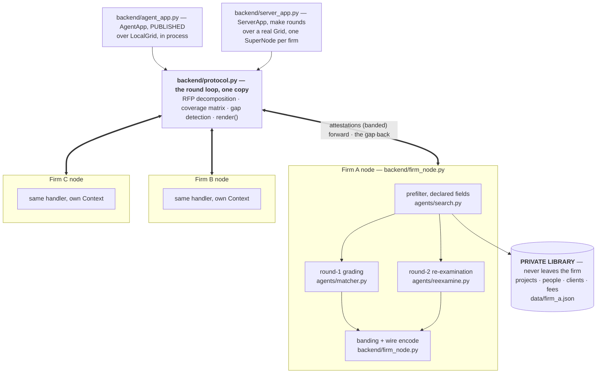

# Consortium — a collaborative disclosure harness for Flower Agents

**Collaborative Agent Hackathon — Flower Labs, University of Cambridge, Wed 26 Aug 2026**
**Track 1: SuperGrid** — *"showcase the collaborative aspect of Flower Agents running on
SuperGrid."* We build that as an agent **harness**: *"Agents can significantly accelerate
our work; how would collaborative agents multiply that?"*

Reference application: AEC qualifications packages (SF330), grounded in the
OpenAsset / Axomic workflow.

---

## Status — read this before quoting anything below

This document started as the plan and has been **updated in place** against what the code
actually does. It is now both: the reasoning that got us here, and an accurate description of
what runs. Where the build diverged from the plan, the divergence is marked inline rather
than quietly rewritten — the reason a decision went the other way is usually worth more than
the decision.

Three stages of the four-stage loop run:

```
attest  ->  detect gap  ->  re-examine locally against the gap  ->  [minimise disclosure, gate on a human]
                                                                    ^ designed §5.4, NOT BUILT
```

| | State |
|---|---|
| **Built and verified end to end** | Round 1 (structured prefilter + model grading), gap detection, round 2 gap-directed re-examination, the coverage matrix, the event trace, the text renderer, both app surfaces, four scenarios |
| **Not built** | The disclosure optimiser, the approval gate, SF330 assembly, the three-condition baseline harness, the bander. `backend/optimiser.py`, `approval.py`, `assemble.py`, `baselines.py`, `bander.py`, `transport.py`, `coverage.py` are docstring-only stubs. |
| **Verified numbers** | 2 rounds to convergence, 32.4 kB banded on the wire, **2 bytes** of gap travelling back, **0 B** of record content, bid goes from NON-COMPLIANT to compliant |

Two consequences for anyone reading this to prepare for judges. **§5.4, §7.1 and §7.2
describe unbuilt work** — they are design, and `docs/demo-script.md` §*What we do not claim*
is the wording to use out loud. And **§13's Q&A answers have been corrected** where they
claimed an artefact we do not have; the corrected answers are stronger, not weaker.

---

## 0. The track, and what we must hand in

The track asks for **a new agent harness that runs on SuperGrid and is published on Flower
Hub, showcasing the collaborative aspect of Flower Agents.** That phrasing sets two
pass/fail gates and six scored axes. Everything in this document is arranged around them.

### 0.1 Submission gates — binary, not scored

| Gate | Evidence | Owner | Deadline | State |
|---|---|---|---|---|
| **Published Flower Hub app** | live URL `flower.ai/apps/i53n1/consortium/`, runnable by a judge | Flower | **11:30 stub, 16:30 final** | **cleared** — stub published ~11:30, `0.3.0` live; republish at 16:30 |
| **Open-source repo** | public GitHub, Apache-2.0, `LICENSE` file present | all | 16:50 | **cleared** — `LICENSE` at `ad87d06` |

Neither is a demo feature. A perfect demo with no published app does not qualify. §10 is
the publishing runbook; **T0 in §11 clears both gates before we write scenario code.**

The organisers' own wording — schedule, venue, Slack channel, required reading, the shared
model endpoints and their 5-minute task timeout, the submission fields, and the six judging
axes — is in `event.md`. Read it once.

### 0.2 Scored axes, and the artefact that evidences each

| Axis | Our evidence | Where it lives | State |
|---|---|---|---|
| **Impact** | JVs bid federal work by emailing spreadsheets; the harness is the missing primitive | §1 pitch, §14 roadmap, deck slides 1, 2, 4 | holds |
| **Innovation** | ~~a *constrained disclosure optimiser* with a human gate~~ → **gap-directed re-examination**: the coordinator broadcasts what nobody can answer, and a node answers it from data it already had | §5.3 round 2 | **axis re-aimed** — the optimiser is not built (§5.4), so innovation rests on round 2, which is built and demonstrable |
| **Flower** | genuine `AgentApp` on SuperGrid, published to Hub, run from `flwr chat`; one protocol over three `Grid` transports | §6 mapping, §10 runbook | holds |
| **Execution** | it runs end to end, live, from a page-driven split screen | §7, §8, `demo-script.md` | holds — but the three-condition table is **not** built (§7.1) |
| **Presentation** | 4-minute table demo, rehearsed twice; split-screen `make stage` | §8 demo | holds |
| **Safety** | banded egress by construction, cost-3 refusals honoured, 0-byte proof measured on the wire | §5.2, §7.2 | holds in **weaker form** — no bander, no approval gate, so no rejection or approval counts |

**Safety is a scored axis, not a compliance chore** — but be precise about which claim we
own. We do not have a guardrail that fires; we have a schema in which the leak is
*unrepresentable*. No field on an `Attestation` can carry a client, a fee, or a name, so
`record_bytes` is 0 by construction rather than by enforcement. That is a stronger property
and a narrower claim. §7.2 has the corrected ledger; do not narrate a rejection counter.

**Innovation moved.** The plan rested this axis on the optimiser. The optimiser is not built,
and the thing that did get built is a better answer to the track's own question anyway — see
§2 and §5.3. Lead with round 2.

### 0.3 The clock

| Time | Event |
|---|---|
| 17:30 | **Demos ready.** Judges come to the table. |
| — | 3–5 minutes each, at the table, conversational |
| 18:45 | Winners announced; top 3 present on stage |

Working backwards: code freeze **16:50**, final Hub publish **16:30**, two timed rehearsals
between 16:50 and 17:30.

---

## 1. The pitch

Large federal infrastructure work is bid by **joint ventures**: three or four architecture
and engineering firms partner on a single pursuit, each contributing project qualifications
and key personnel. Those same firms compete against each other on the next three pursuits.

So every JV has an awkward problem. To produce a compliant SF330 the partners must
establish, together, that the team covers every requirement in the solicitation. But a
firm's full project history exposes its client relationships and contract values, and its
full roster is a recruiter's shopping list. Today this is solved by emailing spreadsheets
around and hoping.

Consortium is **a harness for agents that are not allowed to pool their data.** It puts an
agent next to each party's private library and gives those agents a protocol: establish
compliance by exchanging **attestations** — banded, anonymised evidence that a matching
record exists — never the records; broadcast the *gap* rather than the answer so each agent
re-queries its own data with a question it did not know to ask; then compute the *minimum
set of disclosures* that closes the gap, and route each one through a human owner.

SF330 bid assembly is the reference application shipped with it. The harness is the
deliverable.

**One-line demo, as planned:** *three firms discover their joint bid is non-compliant, fix
it, and assemble the SF330 — while each firm releases nine records out of forty and never
names its confidential clients.*

**One-line demo, as built:** *three firms discover their joint bid is non-compliant and fix
it — without a single byte of record content crossing the wire, and on a two-byte question
travelling back.* The nine-of-forty half needs the optimiser (§5.4) and the SF330 half needs
assembly (`backend/assemble.py`); neither is built. What replaced them is measurable and
already true: **0 B** of record content, **2 bytes** of gap, **32.4 kB** of banded
attestations forward.

### 1.1 Why this is a harness and not an app

A harness is the part someone else can reuse. Strip out SF330 and what remains is a
four-stage collaboration protocol with no domain in it:

```
attest  ->  detect gap  ->  re-examine locally against the gap  ->  minimise disclosure, gate on a human
[--------------------- built and running ---------------------]     [------ designed, §5.4 ------]
```

That loop applies unchanged to any set of parties who must jointly prove a property they
cannot each verify alone and cannot pool data to check: consortium bids, multi-hospital
cohort feasibility, cross-bank sanctions triage, supply-chain conformance. The domain
enters only through three pluggable pieces — a requirement set, a closed banding
vocabulary, and a disclosure-cost function. That separation is the reason this belongs on
Hub rather than in a repo.

Say this sentence in the demo: **"the SF330 is the example; the harness is the product."**

---

## 2. The design constraint

> **No single firm can assess whether the JV is compliant.**

Each firm sees only its own coverage and cannot know which of its assets are actually
load-bearing. The federated coverage matrix is the only artefact that reveals the true gap.

If any one firm can determine compliance alone, the system did not need to be distributed.
The synthetic corpora are engineered backwards from this, and `data/generate.py` refuses to
commit a corpus where it stops being true.

**As built, the constraint holds in a sharper form than "each firm overestimates".** It is not
that a firm judges its coverage wrongly — it is that the gap is *outside what any firm can
ask*. R4 is a Section G join, no firm's declared fields describe one, so no firm's search
reaches it and no firm claims it. Each covers five of six and stops. See the correction in §4.

This is also the answer to the track's own question. Collaborative agents do not multiply
because three copies work faster; they multiply because **agent B answers a question agent
A could not know to ask.** Round 2 is that claim, made executable.

---

## 3. Why SF330 is the right reference application

The form is structurally a gift:

| Section | Content | Why it matters here |
|---|---|---|
| **E** | Resumes of key personnel | Your "employee bios" workflow |
| **F** | Example projects — **maximum 10** | Your "project sheets" workflow; the cap forces selection |
| **G** | Matrix: which key person worked on which example project | The join — and the source of the demo moment |

Section G is the crux. It is not enough to have healthcare people and seismic people. The
matrix demands *this named individual, on that named project*. Firms routinely believe they
are covered at the aggregate level and are not covered at the cell level.

The Section F cap of ten projects is what turns disclosure into an optimisation problem
rather than a dump.

---

## 4. The scenario

**Solicitation:** federal healthcare facility, seismic zone, design-build.

**The JV:** Firm A (large multidisciplinary, healthcare-heavy), Firm B (structural
specialist, seismic-heavy), Firm C (mid-size regional, strong federal past performance).

**Requirements (abbreviated):**

| ID | Section | Kind | Predicate | Min count |
|---|---|---|---|---|
| R1 | F | MANDATORY | sector=healthcare, value >= $50M, completed <= 7 yrs | 3 |
| R2 | F | MANDATORY | delivery=design-build, federal client | 2 |
| R3 | E | MANDATORY | role=PM, credential=PMP, healthcare experience | 1 |
| R4 | G | MANDATORY | **one person with healthcare AND seismic retrofit** | 1 |
| R5 | E | WEIGHTED | role=structural lead, credential=SE | 1 |
| R6 | F | WEIGHTED | LEED Gold or better | 2 |

**The engineered gap: R4.** Firm A has healthcare personnel. Firm A has seismic
personnel. Firm A has nobody who is both — and does not realise this, because its internal
view is by discipline, not by the Section G cell. Firm B has exactly one such person
(`FIRM_B::PERSON::007`), booked to a project Firm B filed as **civic**, whose bio is the only
place the acute-care work is described.

Nobody finds R4 alone. The federated round finds it.

> **Correction from the run — say this version instead.** The plan says each firm
> "self-assesses **compliant**" in round 1 and is "confidently wrong". It does not. Each firm
> covers R1, R2, R3, R5 and R6 on its own, and **no** firm reaches R4 at all, because no
> firm's declared fields describe a Section G join. The "all three believe they are fine"
> reading is `ground_truth.json`'s `self_assessment`, which drops `join` from the predicate —
> and that baseline never executes on the run path (§7.1).
>
> The correct line is: **"each firm covers five of six on its own; R4 is invisible to
> structured search at every one of them — and it takes the joint matrix to license the one
> local re-read that finds it."** That is what the run shows, and it is a better argument for
> the protocol than the version we planned: the gap is not a firm's misjudgement, it is
> structurally outside what any firm can ask.

---

## 5. Architecture

### 5.1 Components

As built. The plan drew one module per stage; the build collapsed that into one protocol
module plus two thin surfaces, for the reasons in §6.1.



The protocol lives in `backend/`, both model calls in `agents/`, and the private libraries in
`data/` — one file per firm, read only by that firm's node. Directory ownership and the rules
for working across it are in `CLAUDE.md` at the repo root.

**Not in the diagram, because not built:** the disclosure optimiser, the BD approval gate,
SF330 assembly, and the bander. `backend/README.md` has the full stub-to-reality map. The
node's outbound path is `firm_node.encode`, not a validating egress filter — see §5.2.

### 5.2 The attestation schema — the privacy boundary

The schema is the guarantee, and it is the core of the **safety** story. A struct that
structurally cannot carry a client name, a fee, or a person's identity. It ships as
`backend/schema.py` and is **frozen at 11:20** — every other task depends on it.

```python
from dataclasses import dataclass, field
from typing import Literal

AssetKind = Literal["PROJECT", "PERSON"]

@dataclass
class Attestation:
    handle: str                   # "FIRM_B::PERSON::007" — opaque, firm-local
    firm: str
    kind: AssetKind
    requirement_id: str           # which requirement this answers
    match_strength: float         # 0-1
    banded: dict[str, str]        # ONLY banded values, closed vocabulary:
                                  #   value_band: "50-100M" | "100-250M" | ...
                                  #   recency_band: "0-3y" | "3-7y" | "7y+"
                                  #   sector: closed set
                                  #   credentials: closed set
                                  #   delivery: closed set
    disclosure_cost: int          # 0 free | 1 NDA-limited | 2 competitively sensitive
                                  # | 3 blocked (will never be released)
    links: list[str] = field(default_factory=list)
                                  # same-firm handles only: person <-> project,
                                  # enabling Section G cells without naming anyone
    note: str = ""                # <=120 chars, passes bander validator
```

The dataclass above shipped as planned, with `VOCABULARY`, `SECTION_F_CAP` and
`NOTE_MAX_CHARS` alongside it, and `disclosure_cost` 3 meaning *blocked*.

**What actually holds, and what does not.** The plan put these invariants in a validating
egress filter (`backend/bander.py`). That filter was never built, so the honest split is:

| Invariant | State |
|---|---|
| Exact contract values banded before leaving the node; exact dates banded to ranges | **holds** — `firm_node.band_project` / `band_person`, against the scenario's fixed `as_of` |
| `links` restricted to same-firm handles | **holds** — filtered on the firm prefix in `firm_node`, asserted across every corpus by `tests/test_invariants.py` |
| No client name, project title, or person name in any field | **holds structurally** — there is no field that can carry one. `note` is generated from requirement-side vocabulary, never from record text. |
| Cost-3 records never offered | **holds** — excluded in `agents/search.eligible`, so both rounds inherit it |
| Outbound byte counter | **holds** — `backend/trace.py`, counting banded and record bytes separately |
| Every key in `banded` validated against the closed vocabulary, unknown keys **rejected** | **NOT BUILT.** Values are constructed from `VOCABULARY` rather than checked against it. |
| `note` regex-scrubbed for proper nouns, currency, addresses | **NOT BUILT** — and unnecessary as things stand, since `note` is never built from record prose |
| Rejection counter | **NOT BUILT.** There is nothing to count. |

**Key property, and it does hold:** the coordinator computes the full coverage matrix and
proves compliance or non-compliance from attestations alone, before any record is disclosed.
Measured: `record_bytes: 0` in every trace.

**Reject, do not sanitise** — keep the argument, drop the claim. It is the right design and
it is worth a sentence *as design*, because a sanitising filter teaches an agent that leaky
output is acceptable and ships whatever the regex missed. But we did not build either filter,
so do not tell a judge the guardrail fired. The stronger available claim is that the leak is
**unrepresentable**: no validation runs on egress because there is no field for a validator to
catch anything in. A rejecting bander is what you would need the moment `note` carried
model-generated prose — which is exactly why it does not.

### 5.3 The round protocol

**Round 1 — decomposition and blind bidding** — *built*

Coordinator parses the scenario's solicitation into typed `Requirement` objects and
broadcasts them. Each firm agent searches its own library and returns attestations.
Coordinator builds the coverage matrix.

Two things the plan did not anticipate:

- **The search is a structured prefilter, and a predicate key with no declared source
  fails.** That is not a limitation, it is the mechanism: R4 asks for
  `experience: seismic-retrofit`, no record declares an `experience` field, so round 1
  *cannot* reach it however hard it looks. The round boundary and the declared/prose boundary
  are the same line.
- **A model does run in round 1, and it may not change the matrix.** It grades whether each
  filing is borne out by that record's own prose — `corroborated` (strength 1.0) or `thin`
  (0.7) — and `agents/matcher.py` refuses it both moves that would matter: it cannot nominate
  a record it was not shown, and `thin` is a grade rather than a veto. Nomination would find
  the Section G cell a round early and there would be no round 2; a veto would drop a declared
  match on a sampled completion. Run it with and without a model and the matrix is identical.

*Actual output:* R4 uncovered — 0 attestations, from any firm. Each firm covers five of six
on its own (see the correction in §4).

**Round 2 — re-examination in light of the gap** — *built; this is the demo*

Coordinator broadcasts the *gap*: the uncovered requirement ids and their predicates. In the
default scenario that is the string `R4` — **two bytes** — and nothing else.

Each firm re-queries **its own library** with a question round 1 gave it no reason to ask.
Firm B's agent re-reads a bio whose projects are all *filed* as civic, and whose prose
describes base isolation and moment-frame strengthening on an acute-care wing. It returns the
handle; `firm_node` then checks the Section G join **in code** against the record's same-firm
`links`, because a structural fact is not something to trust a model to assert.
`match_strength` is 0.8 — above tau, below a declared match — because this is a judgement
about prose.

Verified: `firm B  R4 <- FIRM_B::PERSON::007`, firms A and C return nothing, R4 goes green,
and the loop **converges at round 2** rather than running a third round.

*Local recompute informed by global state, iterated over rounds.* Say it in the pitch —
this audience reads it immediately as the shape of federated learning, and it is the
literal answer to "showcases the collaborative aspect".

**Round 3 — minimum disclosure and human approval** — **NOT BUILT**

The design: coordinator solves for the cheapest set of disclosures satisfying all MANDATORY
requirements within the Section F cap of ten projects, requests full content on only those
handles, and **each firm's BD lead approves or denies each request individually.** On a denial
the optimiser re-runs and finds the next-cheapest substitute. Approved content flows back; the
SF330 assembles.

None of that runs. `backend/optimiser.py`, `approval.py` and `assemble.py` are docstrings.
What exists to make the design credible is in the data rather than the code:
`disclosure_cost` on every record, cost-3 excluded from the candidate set in both rounds, and
a substitutable cost-2 record that `tests/test_invariants.py` asserts exists.

**The loop stops on its own.** `ROUNDS` is a ceiling, not a count — `protocol.run` breaks when
the gap closes (`stopped: "converged"`) or when a round returns nothing new
(`stopped: "no-new-evidence"`). A third identical broadcast costs time and finds nothing. So
"round 3" is a stage of the design, not a round the demo reaches.

### 5.4 The disclosure optimiser — **NOT BUILT**

> Design only. `backend/optimiser.py` is a docstring. This section is the specification for
> whoever picks it up, and the roadmap line on the deck — it is **not** something to narrate
> as a feature. `tau = 0.6` and `section-f-cap = 10` are already in `pyproject.toml`'s run
> config, and both round-1 grades (1.0, 0.7) and round 2's (0.8) sit above tau precisely so
> that this can be dropped in without re-tuning anything upstream.

Weighted set cover, solved greedily. Deterministic, explainable, and fast.

```
minimise   sum( disclosure_cost(h) for h in chosen )
subject to every MANDATORY requirement r:
               count( h in chosen : covers(h, r) and strength(h,r) >= tau ) >= min_count(r)
           |{h in chosen : h.kind == PROJECT}| <= 10        # SF330 Section F cap

greedy step: pick h maximising
             (newly covered requirement-slots, weighted by requirement weight)
             / (disclosure_cost(h) + 1)
```

The `+1` keeps free records preferred but not free-only; the weighting is what produces the
"found a cheaper substitute" beat. Cost 3 (blocked) handles are excluded from the candidate
set entirely — the firm's agent never even offers them. **That last clause is the one part of
this section that is built**, in `agents/search.eligible`, and it is worth showing: a refusal
a second look could route around would not be a refusal.

**Deliverable metric as planned:** *compliance achieved, disclosure minimised.* Two axes, and
you win on both. **As built:** the first axis is measured and the second is not. Compliance
goes from NON-COMPLIANT to compliant in two rounds; disclosure is not minimised because
nothing is disclosed at all — the run ends with the coverage matrix proven and every record
still on its own node.

---

## 6. Flower mapping

Verified against the installed `flwr 1.34.0`, not from memory.

| Concept | Flower construct | State |
|---|---|---|
| **Harness entry point, published to Hub** | `AgentApp` — `[tool.flwr.app.components] agentapp = "backend.agent_app:app"` | built; **the only component the FAB declares** (§6.1) |
| Harness body | `@app.main()` over `(agent: AgentSession, context: Context)` | built |
| Every model call in every agent | `agent.responses.create({...})` — Open Responses shape, supports `"stream": True` | built, **and handed down**: a `ClientApp` never sees an `AgentSession`, so `make_client_app(reader)` injects it into the nodes |
| Tool access for an agent | `agent.connectors.tools([...])` / `agent.connectors.call(...)` | **unused.** Each node reads its own library directly; there was no second tool to reach for. |
| Operator input (the solicitation) | `context.run_config["agent.input"]`, declared as `[tool.flwr.app.config.agent] input = ""` | built |
| Invocation on SuperGrid | `flwr chat` -> `@i53n1/consortium <solicitation>` | built |
| Per-firm node holding a private library | `ClientApp` — handler in `backend/firm_node.py`, three lines of `client_app.py` | built |
| Coordinator round loop | **`backend/protocol.py`**, parameterised by a `Grid`; `ServerApp` and `AgentApp` both call it | built — the loop is not in `ServerApp` (§6.1) |
| Grid, in process, where the AgentApp has none | `backend/local_grid.py` implementing `Grid` over `ClientApp` instances, nodes run concurrently | built — not in the plan; forced by the AgentApp having no `Grid` |
| Attestation transport | `RecordDict` -> `ConfigRecord`, a single JSON payload each way | built. `MetricRecord` unused. |
| Protocol event stream | `RuntimeAgentSession.push_run_events` -> `Control.StreamRunEvents`, so `flwr chat` sees the same events the page does | built, `hasattr`-guarded — absent from the public `AgentSession` ABC, so strictly a bonus |

### 6.1 The one architectural decision — **RESOLVED at ~12:00, against the plan**

`flwr` validates an app as an **agentapp bundle** the moment `agentapp` appears in
`[tool.flwr.app.components]`; `serverapp` and `clientapp` then stop being required. Whether
one FAB may usefully carry *all three* is not documented, and we were not going to find out
at 16:00.

**Plan of record was: ship both surfaces in one FAB.** That is not possible.

**What happened.** The local CLI validates all three components happily. Hub does not:
`flwr app publish` returns **`422 — must contain either only 'agentapp' or exactly 'serverapp'
and 'clientapp'`**. It only surfaces at publish time, which is exactly why T0 published a stub
before any scenario code existed.

**Resolution: the FAB declares `agentapp` only.** Neither the plan-of-record combination nor
the pre-decided `hub/` fallback. Three knock-on effects, all of them load-bearing:

1. **`flwr run .` no longer runs the federation.** The SuperLink derives the task type from
   the FAB's declaration alone (`_get_app_type`), so every `flwr run .` of this project starts
   the *harness*, and `--federation-config num-supernodes=N` is accepted and silently ignored.
   The federated surface therefore runs through `flwr.simulation.run_simulation`, driven by
   `backend/rounds.py` — that is what `make rounds` is.
2. **The round loop had to leave `server_app.py`.** Two surfaces need the same loop, so it
   moved to `backend/protocol.py`, parameterised by a `Grid`. Neither surface owns it.
3. **The AgentApp gets no `Grid` at all** — `@app.main()` receives `(agent, context)`, and the
   runtime strips every `flwr` requirement from the app's dependencies, so `run_simulation`
   cannot even be imported there. Hence `backend/local_grid.py`, a `Grid` implemented over
   `ClientApp` instances with one `Context` per firm.

`serverapp` and `clientapp` survive as modules in the repo and are how we demo; they are just
not declared in the bundle. Recorded in `decisions.md`.

### 6.2 Dual-runtime compatibility is a Hub requirement

A published app must run in **both** simulation and deployment without code changes. The
documented discriminator is `context.node_config`:

```python
if "partition-id" in context.node_config and "num-partitions" in context.node_config:
    library = load_sim_library(context.node_config["partition-id"])   # data/firm_{a,b,c}.json
else:
    library = load_local_library(context.node_config["library-path"]) # real SuperNode
```

**Built**, in `backend/firm_node.py:load_library` rather than `client_app.py` — the node-side
logic all moved there so the published harness and the federated surface answer a round
through the identical handler. It cost about eight lines, as expected.

One detail the plan did not have: the simulated branch also takes a **scenario slug**, naming
which synthetic corpus a partition stands for. The deployment branch ignores it entirely — a
real node's data is whatever its `library-path` points at, and no coordinator gets to redirect
that.

---

## 7. Evaluation — the 20 minutes that probably wins it

### 7.1 The three conditions — **NOT BUILT as a measured table**

The design, and still the right evaluation:

| Condition | Data access | Compliant? | Records disclosed |
|---|---|---|---|
| **Isolated** — each firm self-assesses | own library | **No** | 0 |
| **Consortium** — federated attestation | own library + peer attestations | **Yes** | **9** |
| **Centralised pool** — all libraries in one index | everything | Yes | **~40** (full exposure) |

> `backend/baselines.py` is a docstring and `make baselines` prints nothing. Nothing in this
> table is measured by a run. The 20 minutes went to the frontend and to round-1 grading.

**What we do have, and it is not nothing.** `data/generate.py` reads every scenario's corpora
three ways and commits the result to `ground_truth.json`, so the readings the table would
score already exist and are checked on every `make check`:

| Reading | Sees | Is the condition |
|---|---|---|
| `round_one_coverage` | declared fields only | what round 1 can match |
| `self_assessment` | + own free text, `join` dropped | a firm alone |
| `coverage` | + free text, everything | the centralised oracle |

The gap between `round_one_coverage` and `coverage` is exactly one requirement, and
`generate.py` **refuses to write** if it ever closes. So the claim "consortium reaches what the
centralised pool reaches" is enforced in the corpus rather than measured in a run — a weaker
form of evidence, but a checkable one, and `tests/test_scenarios.py` re-runs it over all four
scenarios.

**Two corrections to the table itself**, both of which survived into the docs and should not
be said out loud:

- The isolated row's *"R4 gap undetected, all three firms believe otherwise"* is the
  `self_assessment` reading, which drops the Section G `join`. On the run path no firm claims
  R4 at all. See §4.
- The consortium row's **9** and the pool's **~40** need the optimiser to produce. Nothing is
  disclosed in the run as it stands, so the honest disclosure figure for the consortium
  condition today is **0**.

Hackathon judges almost never see an actual evaluation, and this is the biggest thing we
left on the table. Say so; it costs less than being caught.

### 7.2 The safety ledger — a scored axis, so make it an artefact

Safety here is not "we thought about privacy". It is numbers the harness prints at the end of
every run, checkable on the spot. Two of the four planned claims are instrumented and true;
two need code that does not exist.

| Claim | Instrument | Value | State |
|---|---|---|---|
| No raw record left a node before authorisation | byte counter in `backend/trace.py`, `record_bytes` counted separately from `banded_bytes` | **0 B** against 32.4 kB banded | **holds**, and stronger than planned — 0 by construction, not by filtering |
| No confidential client was named | no field on `Attestation` can carry one | **0 names** | **holds structurally** — but *not* via a "closed-vocabulary validator; unknown key = rejection". There is no validator. |
| Every disclosure had a named human approver | per-record approval log in `backend/approval.py` | — | **NOT BUILT.** Also vacuously true: there are no disclosures. |
| A refusal is honoured, not routed around | cost-3 handles never enter the candidate set, in **both** rounds | cost-3 records excluded | **holds in part** — the exclusion is real (`agents/search.eligible`) and testable; the "1 denial, 1 substitution" beat needs the optimiser |

**The number we can add that was not in the plan:** the gap costs **2 bytes** travelling back
against **32.4 kB** of attestations travelling forward. `trace.py` counts `gap_bytes`
separately from the round's payload for exactly this reason — the claim is that what returns
to the firms is the hole and never the evidence, and that is only checkable if the wire is
measured. That asymmetry is the safety story the run actually tells.

~~Include the **rejection** count too.~~ **Do not.** There is no bander, so there is nothing
to count, and "a guardrail that never fires is indistinguishable from an absent one" cuts the
other way here — ours is absent. The available argument is better: the leak is
*unrepresentable* rather than *caught*. See §5.2.

---

## 8. Demo — 4 minutes at the table

Full beat sheet, the compressed 90-second version, and the stage variant are in
`docs/demo-script.md`. Summary of the shape:

`demo-script.md` is authoritative and has been rewritten around what runs. This is the shape:

| Time | Beat |
|---|---|
| 0:00–0:30 | The problem, in the judge's language. "Three firms, one federal bid, competitors next month." |
| 0:30–1:00 | **Hub first.** The published app, and `flwr chat @i53n1/consortium`. Gate cleared in front of them. |
| 1:00–1:50 | Round 1, from the page's **Run** button. Coverage matrix fills. Each firm covers **five of six**; nobody reaches R4. Joint matrix: **R4 red**. |
| 1:50–2:10 | **Why R4 is invisible.** Click R4: every other requirement is answered from a declared field, and no firm's structured fields describe a Section G join. |
| 2:10–2:50 | Round 2. The gap goes back — two bytes. All three nodes re-read their own prose; Firm B alone closes the cell. Converged. |
| 2:50–3:30 | The ledger: **0 B** of record content, **2 bytes** back against **32.4 kB** forward, cost-3 records never offered, the model's sentence never left the node. |
| 3:30–4:00 | Scenario selector — four solicitations, the gap at a different firm each time. "The SF330 is the example. The harness is the product." Roadmap line. Stop talking. |

**Split screen, one machine.** `make stage` puts the protocol log in the left terminal pane and
the page in the right browser; `frontend/serve.py` spawns the run with stdout inherited, so
neither half is a recording of the other. The left pane is where *Flower* is visible
(`flwr 1.34.0 · run_simulation · InMemoryGrid · 3 SuperNodes`); the right is where the
*argument* is.

Three beats from the plan are gone because the code is not there: the optimiser's 9-of-40, the
BD denial and live substitution, and the SF330 assembling. They are named as roadmap in the
script's closing section so nobody improvises them under pressure.

Two changes from a stage pitch, both because judges are standing at the table:

- **Lead with the Hub app, not the architecture.** They are ticking a submission gate; give
  it to them in the first minute and the remaining three are yours.
- **Leave silence for questions.** Four minutes of a five-minute slot. §13 is the Q&A prep
  and it is where the marks actually are.

---

## 9. Requirements

### 9.1 Access — verify in the first 30 minutes

`make doctor` checks the local half of this list. The rest is human.

- [ ] **Flower account, and one named person who owns it.** Their username becomes
      `publisher` and cannot be changed later — see §10.3.
- [ ] `flwr login supergrid` succeeds, and `flwr app publish` is permitted for that account
- [ ] Model access confirmed; know the available model strings
- [ ] Fallback direct model API key (SuperGrid contention with ~130 attendees is likely)
- [ ] GitHub repo **public** — it is a submission gate, not a nicety — all teammates pushing
- [ ] Phone hotspot — venue wifi is a known failure mode

### 9.2 Environment

- [x] Python ≥ 3.13, `uv`, `flwr >= 1.34.0, < 2.0`
- [x] `make setup` clean, `make doctor` green, `make build` producing a `.fab`
- [x] `make rounds` executes a full protocol run across three supernodes
- [x] Hello-agent tutorial run end to end **before writing any project code**

Everything routes through the Makefile — `make` lists the targets. `make check` (lint plus
the invariant tests) is the gate before every push: currently **19 tests, 0 skips, lint
clean**.

`make doctor` grew four lines the plan did not have — `model`, `endpoint`, `cache` and
`traces` — because those are what decide whether round 2 finds anything. `make stage` is the
demo target; `make watch` and `make demo` are the unattended variants.

### 9.3 Dependencies

| Package | Purpose | State |
|---|---|---|
| `flwr[simulation]` | rounds, transport, `AgentApp`, Hub publishing | used throughout. The runtime *was* young — §6.1 is what that cost. |
| stdlib `dataclasses` | schema (prefer over pydantic — fewer moving parts) | used; the right call |
| stdlib `urllib`, `hashlib` | the model client and its on-disk cache | used — not in the plan, and the reason the demo survives without an endpoint |
| stdlib `re` | ~~bander scrubbing~~ lexicon word boundaries in `data/generate.py` | used, different job — there is no bander |
| `numpy` | optimiser arithmetic | **declared and never imported.** The optimiser is not built. |
| `pytest`, `ruff` (dev group) | the invariant tests and the lint gate | used |

No web framework, no database, no embedding service — all three held. The frontend's server
is `http.server` from the stdlib.

**`numpy` should come out of `[project.dependencies]`.** Every runtime dependency ends up
inside the published FAB, and this one is dead weight in the bundle for an optimiser that does
not exist. Left in deliberately for now: removing it means a `uv.lock` change and a republish,
and §10.3's "never first-publish after 12:00" logic applies to churn near the freeze too. Take
it out with the optimiser, whichever way that goes.

### 9.4 Data artefacts — build-day critical path

All landed by ~13:00, and **four scenarios** rather than one.

- [x] `data/rfp.json` — 6 typed requirements per §4
- [x] `data/firm_a.json` — 13 projects, 8 people
- [x] `data/firm_b.json` — 14 projects, 8 people, **containing the sole R4 match**
- [x] `data/firm_c.json` — 12 projects, 8 people
- [x] `data/vocabulary.json` — closed sets for sector, bands, credentials, delivery
- [x] `data/ground_truth.json` — three readings, derived and committed (§7.1)
- [x] `data/generate.py` — derives ground truth and **refuses to write** if the gap is gone
- [x] `data/scenarios.json` + `data/scenarios/<slug>/` — three further solicitations:
      `transit-tunnel`, `defence-secure-lab`, `campus-decarbonisation`, each moving the
      delivery method, the client type, the certification threshold and the firm holding the
      gap

The corpora are **hand-authored** rather than LLM-generated: the R4 bio wording is a tuning
parameter that has to be editable at 15:45 without running a generator. `generate.py` does the
part that must never drift by hand — evaluating every typed predicate against every corpus.

Record shapes are fixed in `data/README.md`. `tests/test_invariants.py` guards the two things
that break silently — the vocabulary drifting from `backend/schema.py`, and a corpus edit that
closes the engineered R4 gap — and `tests/test_scenarios.py` re-runs the whole pass over every
scenario. ~~Those tests skip until the corpora land.~~ They are live: 19 tests, no skips.

`vocabulary.json` is **frozen across all four scenarios** and one test asserts it matches
`backend/schema.py` exactly. A scenario needing a new sector would be a schema change, not a
data change — swapping the vocabulary is the §14 roadmap line, not a build-day one.

**Engineering requirements for the corpora — non-negotiable:**

1. Exactly one person across all three firms satisfies R4, at the firm named in
   `scenarios.json` — Firm B for the default scenario, and a different firm in each of the
   other three.
2. That person's bio describes the hospital work in **non-obvious language** — "acute care
   wing structural upgrade", never "healthcare seismic retrofit" — so round 1 misses it and
   round 2 finds it. This is the single most important sentence in the dataset.
3. **Their linked projects must not declare the hidden half either** — otherwise a structured
   round-1 search reaches them and there is no gap left to broadcast. This one was added
   during the build; it is the rule that makes the filing (`civic`) and the prose (acute care)
   disagree.
4. **No firm can join the cell from its own library, even reading its own bios** — or "no
   single firm could have seen this" is not true.
5. Each firm has enough surface coverage to self-assess as compliant. Note what this licenses:
   it holds for the `self_assessment` reading, which drops `join`. On the run path each firm
   covers five of six and none reaches R4 — see the correction in §4.
6. At least one cost-2 record must be substitutable, or the denial beat fails *(the beat is
   not built, but the property is asserted so it can be)*.
7. At least one cost-3 record must be one that **would** have matched, or "the refusal is
   honoured" is a claim about a candidate set that never excluded anything.
8. 2–3 near-miss distractors per firm (right sector, wrong value band; right credential,
   wrong role) so the matcher has something to correctly reject.
9. Keep each `data/**/*.json` under 1 MB — the Hub upload rejects a larger file (§10.3).

`data/README.md` is the maintained copy of this list, with the reason each rule exists in the
failure text `generate.py` prints when it is broken.

---

## 10. Publishing to Flower Hub — the runbook

Verified against the Hub docs and the installed CLI. **Owner: Flower. First run at 11:00.**

### 10.1 Commands

```bash
flwr login supergrid                 # browser auth against the Flower account
flwr app publish .                   # uploads SOURCE; Hub builds the FAB server-side
# ...but publish ignores `fab-exclude`, so `make publish` publishes a staged tree — §10.2
# -> https://flower.ai/apps/i53n1/consortium/
```

Publishing a new version is the same command after bumping `version` in `pyproject.toml`.
**Publish early and often** — every increment, all afternoon. The first publish is the risky
one because it exercises the account, the publisher name, the license file and the file
filter all at once; the tenth is free.

Wrap both in the Makefile at T0 so nobody publishes by hand at 16:25: `make publish` should
bump nothing, run `make check`, then publish the staged tree. Add `make chat` for the SuperGrid
side of the demo.

### 10.2 `pyproject.toml` deltas required for Hub

**Applied at T0.** As shipped, with the §6.1 resolution folded in:

```toml
[project]
name = "consortium"
version = "0.3.0"                       # bump before every publish; `make publish` does not
# Hub renders this as the app description, and it carries the team; >200 chars makes publish ask
description = "A collaborative disclosure harness for agents that cannot pool their data. Team Axomic: Vyacheslav Lukin, Ivan Senilov."
license = { file = "LICENSE" }          # NOT license = "Apache-2.0" — a table, with a file

[tool.flwr.app]
publisher = "i53n1"                     # MUST equal the account name; "consortium" is wrong
fab-format-version = 1
flwr-version-target = "1.34.0"          # tracks uv.lock

[tool.flwr.app.components]
agentapp = "backend.agent_app:app"      # ONLY. Hub 422s on a bundle with all three — §6.1
# serverapp / clientapp stay as modules in the repo, undeclared here

[tool.flwr.app.config]
num-rounds = 3                          # a ceiling; the loop converges at 2
num-firms = 3
tau = 0.6
section-f-cap = 10
model = ""                              # empty = no round 2, and the gap stays open

[tool.flwr.app.config.agent]
input = ""

fab-exclude = [".gitignore", "CLAUDE.md", ".claude/**", "docs/**", "frontend/**", "tests/**"]
```

Three things learned applying it. `make doctor` prints the components generically now, so the
agentapp-only outcome did not raise the `KeyError` the plan feared. `flwr-version-target`
tracks `uv.lock` — `uv sync` reverts an out-of-band bump, so raise the lock first.

And **`fab-exclude` became necessary rather than optional**: Hub keeps only
`.py/.toml/.md/.yaml/.json/.jsonl` plus `LICENSE`, but once any user rule is set, *every*
surviving file must match the list — which is why `.gitignore` is itself excluded. The rest is
excluded so the published app is the harness and not our desk.

**And then, ~15:00, `fab-exclude` turned out not to govern the publish at all.** It is read by
`flwr build`; `flwr app publish` uploads source filtered only by the extension allowlist,
`.flwr/`, `__pycache__` and `.gitignore` (`flwr/cli/utils.py`, `filter_paths_for_publish`). So
`0.1.0`–`0.3.0` each shipped `docs/`, `tests/`, `frontend/`, `CLAUDE.md` and the slide deck's
358 KB `package-lock.json` — 71 files, 832 KB — while `make build` proved a clean 55-file FAB
locally. `make publish` now stages the harness alone (`publish-stage.sh`) and publishes that
directory: 55 files, 312 KB. The staged `pyproject.toml` drops `fab-exclude`, because
`flwr build` raises on an exclude pattern that matches no file and Hub builds the FAB
server-side. Nothing was over Hub's limits, so this was tidiness rather than a fire — but the
sentence above was false for three published versions, which is why it is still here.

### 10.3 Constraints that change the plan

| Constraint | Consequence for us |
|---|---|
| `name` **cannot change after first publication** | `consortium` is final. Locked in at the ~11:30 stub publish. |
| `publisher` must equal the Flower account username | `i53n1`. Settled ~10:45; recorded in `decisions.md`. |
| `LICENSE` file required for `fab-format-version = 1` | Added at T0 (`ad87d06`) — it is also the open-source gate. |
| **A FAB may declare `agentapp` *or* `serverapp`+`clientapp`, never both** | Not in the plan, and the constraint that reshaped the codebase. `422` at publish time only. §6.1. |
| **`fab-exclude` applies to `flwr build`, not to `flwr app publish`** | Publish uploads source filtered by the extension allowlist and `.gitignore` alone. Hence the staged publish (§10.2, `publish-stage.sh`). Only visible by reading the upload manifest — the CLI prints every attached file, and says nothing about what it ignored. |
| Allowed extensions: `.py .toml .md .yaml .json .jsonl`, LICENSE, `.gitignore`, `.editorconfig` | **`frontend/` HTML, CSS and JS are silently excluded from the published app.** See below. |
| 1,000 files, 1 MB per file, 10 MB total | Our corpora are far inside this. Keep each `data/*.json` under 1 MB anyway. |
| Files deeper than 10 directory levels are excluded | Not a risk with the current layout. |
| `.gitignore` patterns filter the upload | `frontend/state/` is gitignored, so run state never ships. Correct. |

**The frontend finding matters, and it held.** A judge who installs the app from Hub gets no
HTML, so the harness's primary output is a legible terminal report written by Python. That
shipped as **`protocol.render()`** — the coverage matrix, the verdict and the byte counts as
text — plus `trace.py`'s per-event terminal lines. (The plan called for a `backend/render.py`;
it was never created, because the renderer is a few lines of the module that already owns the
`Outcome`. The SF330 sections are not rendered because assembly is not built.)

The `frontend/` page is a local demo skin, excluded via `fab-exclude`. It turned out to be the
opposite of a cut candidate: it reads a **protocol event trace** rather than a result document,
which is what lets it show *when* something crossed the boundary — and the boundary is the
argument. It also stayed cut-safe, because `trace.py` prints every event to the terminal too.
The split screen (§8) is that pairing, deliberately.

---

## 11. Task breakdown

Assumes 4 people. With 3, drop the viz owner; the pitch still gets a named owner.

| # | Task | Owner | Where it landed | Window | Outcome |
|---|---|---|---|---|---|
| **T0** | **Hub beachhead.** Flower account, `flwr login supergrid`, `LICENSE`, pyproject per §10.2, stub app in one FAB, `flwr app publish .`, run it from `flwr chat`. | Flower | `pyproject.toml`, `LICENSE`, `backend/agent_app.py` | **10:45–11:30** | **done** — and it earned its place: the all-three-components FAB was rejected here, not at 16:00 (§6.1) |
| T1 | Align on scenario + attestation schema. | all | `backend/schema.py` | 11:00–11:20 | **done**, frozen and never reopened |
| T2 | Synthetic corpora + RFP + vocabulary | Data | `data/` | 11:20–12:10 | **done, x4** — four scenarios, hand-authored, ground truth derived |
| T3 | Repo skeleton, dual-runtime `node_config` branch (§6.2) | Flower | `backend/firm_node.py` | 11:30–12:15 | **done** — landed in `firm_node.py`, not `client_app.py`, so both surfaces share one handler |
| T4 | Local search + structured predicate matcher | Agent | `agents/search.py` | 12:10–13:00 | **done ~14:30**, late — round 1 ran out of `firm_node` until then, and `search.py` refactored the eligibility rules out of both rounds |
| T5 | Attestation serialisation into `RecordDict` | Flower | `backend/transport.py` | 12:15–13:30 | **superseded** — `firm_node.encode` / `decode`, ~10 lines. `transport.py` is a stub; a module for it never earned its place. |
| T6 | Matcher agent prompt, round-1 attestation emission | Agent | `agents/matcher.py`, `agents/prompts/` | 13:00–14:15 | **done ~14:30, re-scoped**: the model *grades* the shortlist and may neither nominate nor veto (§5.3) |
| T7 | **End-to-end round 1 + coverage matrix, R4 showing red** | Flower+Agent | `backend/protocol.py` | -> 15:00 | **done early** — and the matrix lives in `protocol.run`, not `coverage.py` |
| T8 | **Round 2 re-examination** — gap-directed local re-query | Agent | `agents/reexamine.py` | 15:00–16:00 | **done** — the demo. Verified closing R4 against a live endpoint. |
| T9 | Bander + byte counter + rejection counter | Flower | `backend/bander.py` | 13:30–14:00 | **NOT BUILT.** Byte counting landed in `trace.py`; there is no validator and no rejection count (§5.2). |
| T10 | Disclosure optimiser (greedy weighted set cover) | Fusion | `backend/optimiser.py` | 12:00–14:30 | **NOT BUILT** (§5.4) |
| T11 | Approval gate + denial-and-substitute re-run | Fusion | `backend/approval.py` | 14:30–15:15 | **NOT BUILT** |
| T12 | Three-condition baseline harness + safety ledger (§7.2) | Fusion | `backend/baselines.py` | 15:15–16:00 | **NOT BUILT.** `make baselines` prints nothing; the three readings exist in `ground_truth.json` instead (§7.1). |
| T13 | **Text** renderer — the shipped surface (§10.3) | Viz | `backend/protocol.py:render` | 13:30–15:00 | **done** — as `protocol.render()`; `render.py` was never created |
| T14 | HTML skin over the same JSON — the local demo surface | Viz | `frontend/` | 15:00–16:00 | **done, larger than planned** — reads the event trace, replays on its own clock, drives runs from the page, four-scenario selector |
| T15 | Hub app README + description; the page a judge lands on | Viz | `README.md`, Hub metadata | 15:00–16:00 | **done** |
| **T16** | **Final publish.** Bump version, `flwr app publish .`, verify the live URL from a clean shell. | Flower | Hub | **16:15–16:30** | `0.3.0` live; **the 16:30 republish is still to come** |
| T17 | Slides / talking points | Viz | `docs/slides/` | 15:00–16:50 | **done** — Slidev deck, 13 slides, presenter notes naming the axis each serves |
| T18 | **Code freeze.** Rehearse twice, timed, against §8. | all | `docs/demo-script.md` | 16:50–17:30 | **to come** |

**Where the afternoon actually went.** T9–T12 — the entire Fusion lane, four modules — did not
get built, and T4/T6 landed two hours late. What absorbed that time instead was T14, which grew
from a cut candidate into the demo surface, and a second and third pass over round 2 (the prompt
contradiction, §12 R2). That is the trade to be able to defend: **stage four of the loop for a
demo that shows stages one to three actually happening.** Given the run is the thing judges see
and the optimiser would have been a printed table, it was probably the right one — but it costs
us the Innovation framing the plan rested on (§0.2) and the evaluation in §7.1.

### Milestones

- [x] **11:20** — schema frozen. Held, and never reopened.
- [x] **11:30** — **stub app live on Hub and runnable on SuperGrid.** Both gates provisionally
      cleared.
- [x] **12:00** — packaging settled (§6.1) — **against** the plan of record: agentapp-only.
      No further debate, as intended.
- [x] **13:00** — corpora committed. No cut needed; four scenarios rather than one.
- [x] **15:00** — round 1 end to end with the matrix rendering as text. Early.
- [x] **16:00** — round 2 converges and closes R4. Verified against a live endpoint.
- [ ] **16:30** — **final version published to Hub and verified from a clean shell.** Still to
      come, and the one remaining hard gate. `0.3.0` is live; bump `version` first.
- [ ] **16:50** — freeze. Nothing merges after.
- [ ] **17:30** — demos ready.

Every milestone through 16:00 landed. What slipped was not a milestone — it was the whole
Fusion lane (T9–T12), which has no milestone of its own precisely because it was never on the
critical path for the demo.

### Cut list, in strict order

1. ~~HTML skin -> text renderer only~~ — **not cut, and inverted.** It became the demo
   surface; the text renderer stayed as the cut-safe fallback. Both ship.
2. ~~Coverage matrix animation -> static table per round~~ — **not cut.**
3. Approval gate UI -> `input(...)` — **moot**, the gate itself was not built.
4. Denial-and-substitute beat -> single-pass optimiser — **cut past the fallback.** Neither
   exists.
5. Centralised-pool baseline -> keep isolated vs. federated — **cut entirely**, both
   conditions. §7.1.
6. Three firms -> two firms — **not cut.** Three throughout.

So the list was used, but not in its own order: items 4 and 5 went while 1 and 2 grew. The
strict ordering assumed the cut pressure would come from the demo surface. It came from the
Fusion lane instead, which the list did not rank because it was not expected to be at risk.
Worth knowing next time: **rank the lane most likely to be starved, not the artefact easiest
to imagine cutting.**

**Never cut round 2.** Held. Without gap-directed re-examination this is federated RAG with
extra steps, which is exactly the criticism to avoid — and with the optimiser gone, round 2 is
now carrying the Innovation axis alone (§0.2).

**Never cut the Hub publish.** Held. It is not a feature, it is the entry ticket. If the
choice at 16:20 is between a working demo beat and a published app, publish.

---

## 12. Risk register

| # | Risk | Called | Mitigation | What happened |
|---|---|---|---|---|
| R0 | **Hub publish fails late** — wrong publisher, missing LICENSE, file filter, name clash | High / **Fatal** | T0 at 10:45. Publish a stub before writing scenario code, then republish all afternoon. | **Fired, and the mitigation paid for the whole day.** The all-three-component FAB was rejected at 11:30 with a stub, not at 16:00 with a codebase. §6.1. |
| R1 | Reads as "federated RAG" | High / High | Lead with the disclosure optimiser and the human gate, not retrieval. | **Mitigation invalidated** — there is no optimiser to lead with. Lead with round 2 instead: the answer to "isn't this retrieval" is that the *question* is generated by a party that cannot see the data (§13). |
| R2 | Round 2 fails to surface the R4 match | Med / **Critical** | The bio wording is a tuning parameter. If it misses by 15:45, edit the corpus, not the prompt. | **Fired, and the mitigation pointed the wrong way.** The corpora were correct; the *prompt* contradicted itself ("judge the substance" + "do not infer") and Qwen3.5 resolved it by refusing every scenario's evidence. Fixed at `0472ae3`. **Check the prompt first — it is cheaper and it is what was wrong.** |
| R3 | Corpora slip past 13:00 | High / High | Fix schema first, script the generation, cut to two firms without debate. | **Did not fire.** Landed on time at four scenarios. Freezing the schema at 11:20 is what bought this. |
| R4 | `agentapp` + `serverapp`/`clientapp` in one FAB is unsupported | Med / High | §6.1 — tested at T0 with stubs; fallback is a second project dir. | **Fired.** Neither the plan nor its fallback was used: agentapp-only, and the round loop moved to `protocol.py`. Cost more than the estimated twenty minutes, but at 12:00 rather than 16:00. |
| R5 | LLM call volume — naive matching is 60 records × 6 requirements | Med / Med | Prefilter on banded fields; model only on the shortlist. Target ≤ 50 calls per run. | **Did not fire, and the target was the wrong metric.** Actual: **3 calls in round 1** (one per firm, whole matrix) plus one per firm per gap in round 2. Round trips were the cost, not calls — per-requirement was 18 calls and ~2 min a firm. |
| R6 | Venue wifi / SuperGrid contention with ~130 attendees | High / Med | Hotspot; cache model responses. Drive the demo from the local simulation. | **Fired as predicted.** The shared endpoint answers in ~240s under load, and round-1 grading times out at its 120s budget on a cold cache. The response cache is load-bearing, not a convenience — and it is gitignored, so it exists on exactly one laptop. |
| R7 | Attestations leak identifying detail | Med / Med | Bander **rejects** rather than sanitises; rejection counter is a demo asset. | **Mitigation not built** — no bander. Residual risk is low anyway: the schema has no field a leak could travel in, and `note` is generated from requirement vocabulary rather than record prose. It becomes real the moment `note` carries model output. |
| R8 | SF330 unfamiliar to a UK audience | Med / Low | Ten seconds of framing: "US federal qualifications form — Section G is a person-by-project matrix." | Holds; unchanged. |
| R9 | Reads as one app, not a reusable harness | Med / **High** | §1.1. Name the three pluggable pieces out loud. | **Better mitigated than planned.** Four scenarios ship, and the selector switches them in front of a judge — the claim is now demonstrable rather than asserted. |

The call that R0, R1 and R3 would decide this project was half right. **R0 decided it** — the
T0 discipline is the single highest-leverage thing in this document. **R3 never fired.** And R1
turned out to be the wrong worry: the risk was never that the work would *read* as federated
RAG, it was that the artefact distinguishing it from federated RAG would not get built. It did
not. R2 and R6 — the two "medium" model risks — are what actually consumed the afternoon.

---

## 13. Judge Q&A prep

> **These answers have been corrected against what is built.** Four of them claimed the
> optimiser, the nine-of-forty figure, a measured centralised-pool row, or a rejection
> counter. Struck text is what *not* to say.

**"Isn't this just federated retrieval?"**
~~The contribution is deciding what to reveal: a constrained optimisation over disclosure
cost… Remove the optimiser and the firms are back to disclosing everything.~~ **Do not say
this — the optimiser is not built.**

Say instead: retrieval answers a question someone knew to ask. Here **no participant can
formulate the question.** R4 is a Section G join that no firm's declared fields describe, so
no firm's search — however good its retrieval — reaches it. What makes it findable is the
coordinator observing that *nobody* answered, and sending back the shape of the hole: two
bytes. Firm B then re-reads data it already had, and finds the cell. The retrieval was always
possible; the *question* was not, and the question is what the protocol produces. Constrained
disclosure is the next stage of that design (§5.4) and is on the roadmap, not in the run.

**"What makes this a harness rather than an application?"**
Three pluggable pieces and nothing else is domain-specific: a requirement set, a closed
banding vocabulary, and a disclosure-cost function. Swap those and the same four-stage loop
runs cross-hospital cohort feasibility or supply-chain conformance. That is why it is on
Hub — someone else installs it and brings their own three.

**"The coordinator sees all attestations — that's centralisation."**
Same relationship as gradients to training data. Attestations are banded, anonymised
existence proofs bounded by a closed vocabulary; the coordinator can prove compliance
without being able to identify a single client, fee, or person. The optimiser is
associative and can be run hierarchically or peer-to-peer with no protocol change.

**"Why not pool the libraries into one index?"**
~~We ran it — the centralised-pool row… We match its compliance at nine.~~ **Do not say this.
We did not run it** (§7.1).

Say instead: pooling reaches the same compliance and requires every firm to expose its whole
library to its next competitor, which is why no firm does it. What we can show is the
*equivalence*, checked rather than measured: `data/ground_truth.json` carries the oracle
reading — a perfect reader over all three libraries — and the consortium run reaches the same
coverage on every requirement. `data/generate.py` refuses to commit a corpus where those two
diverge, and `make check` re-runs it over four scenarios. The disclosure comparison needs the
optimiser; the compliance comparison does not, and that is the half we have.

**"Is this multi-agent, or one agent called three times?"**
The agents hold disjoint tool access; none can query another's library, and each runs in its
own process with its own `Context`. Round 2 changes each agent's *local* behaviour based on the
global gap — they ask their own data new questions, and you can watch it in the left pane: all
three nodes re-read their own prose, and only Firm B's returns a handle.
~~Remove peer state and all three firms self-certify as compliant and are wrong, which we show
as our first baseline.~~ Remove peer state and each firm covers five of six with R4
unreachable — no firm can even pose the question (§4, and there is no baseline harness to show
it with).

**"Why Flower rather than LangGraph?"**
LangGraph orchestrates agents inside a trust domain. Here the premise is that no such domain
exists — the participants are active competitors. Round-based coordination across nodes
that cannot share state is precisely Flower's primitive.

**"How do collaborative agents multiply the work, rather than just parallelise it?"**
Parallel agents each answer their own question faster. These answer a question none of them
could pose: Firm B's agent only finds the R4 person because the coordinator told it about a
gap that exists in Firm A's coverage. The information that unlocks the search is held by a
party that cannot see the data the search runs over. That is the multiplier.

**"What is the safety story?"**
~~Four instrumented claims… every disclosure carries a named human approver… plus a rejection
counter, so you can see the guardrail actually fired.~~ **Do not claim the approver log or the
rejection counter** (§7.2).

Say instead: the leak is not *caught*, it is **unrepresentable**. No field on an `Attestation`
can carry a client, a fee, a title, or a name, so `record_bytes` is 0 by construction rather
than by filtering — and it is measured on the wire, not asserted. Three claims, all
instrumented in `backend/trace.py`: **0 B** of record content against 32.4 kB of banded
attestations; **2 bytes** travelling back to the firms, counted separately because "what
returns is the hole, never the evidence" is the whole point; and cost-3 records excluded from
the candidate set in both rounds, so a refusal is not something a second look can route
around. The model's own reasoning stays on the node — it goes to the local log, and the wire
gets requirement-side vocabulary.

If pushed on what is missing: the human approval gate, because nothing is disclosed yet. That
is stage four (§5.4), and it is the honest answer.

**"Does it really run on SuperGrid?"**
It is published at `flower.ai/apps/i53n1/consortium` and invoked with
`flwr chat @i53n1/consortium`. We drive the table demo from the local simulation for
reliability with 130 people on the venue wifi, not because the deployment path is a mock — and
the thing that makes that credible is that **both paths run the same `protocol.run`**, over a
different `Grid`. The left pane names which one: `InMemoryGrid` under the simulation runtime,
`LocalGrid` inside the published harness, `GrpcGrid` against a real SuperLink.

**"What would you build next, given another two hours?"**
The optimiser, and only the optimiser (§5.4). Everything it needs is already in place —
`disclosure_cost` on every record, cost-3 exclusion, `tau` and the Section F cap in the run
config, and three match strengths that all clear tau deliberately so the set-cover step can be
dropped in without re-tuning. It is the one missing piece that turns "we proved compliance" into
"we proved compliance and minimised what it cost to prove".

---

## 14. Roadmap slide (say it, do not build it)

Every completed pursuit is a labelled example: this evidence set, against this solicitation,
won or lost. Firms federate a **win-rate prior** over requirement-to-evidence matching —
learning which qualification patterns actually convert — without any firm exposing its bid
history or its losses.

That is federated learning over commercial outcomes, in a market where nobody will ever
pool the data. It is also a product Axomic could plausibly ship.

---

## Appendix: repo layout

As built. `[stub]` marks a file that is a docstring and nothing else — see §5.2, §5.4, §7.1.

```
consortium/
├── CLAUDE.md                     # working agreement: worktrees, one branch, ownership
├── LICENSE                       # Apache-2.0 — required by Hub, required by the open-source gate
├── README.md                     # also the Hub app landing copy — T15
├── Makefile                      # make stage / check / publish — `make` lists the rest
├── pyproject.toml                # agentapp ONLY (§6.1); Hub metadata per §10.2
├── data/                         # Data owner — T2
│   ├── README.md                 # record shapes + the non-negotiable corpus rules
│   ├── rfp.json                  # 6 typed requirements per §4
│   ├── vocabulary.json           # closed sets — frozen against backend/schema.py, one test asserts it
│   ├── firm_a.json               # private library, one file per firm
│   ├── firm_b.json               #   — holds the sole R4 match: PERSON::007, filed civic
│   ├── firm_c.json
│   ├── ground_truth.json         # three readings: declared / firm-alone / oracle (§7.1)
│   ├── generate.py               # derives ground truth; REFUSES to write if the gap closed
│   ├── scenarios.json            # the manifest: four scenarios, their gaps and lexicons
│   └── scenarios/                # transit-tunnel, defence-secure-lab, campus-decarbonisation
│       └── <slug>/               #   rfp.json + firm_{a,b,c}.json + ground_truth.json
├── backend/                      # Flower + Fusion owners
│   ├── protocol.py               # THE ROUND LOOP — attest, detect gap, converge; render()
│   ├── schema.py                 # Requirement, Attestation, closed vocabulary — frozen 11:20
│   ├── firm_node.py              # the node: dual-runtime load, banding, predicate semantics,
│   │                             #   round-1 attest, round-2 reexamine_gaps, wire encode/decode
│   ├── local_grid.py             # in-process Grid for the AgentApp, which gets none (§6.1)
│   ├── agent_app.py              # AgentApp — the harness, PUBLISHED to Hub — T0
│   ├── server_app.py             # ServerApp — same protocol over a real grid
│   ├── client_app.py             # three lines: app = make_client_app()
│   ├── rounds.py                 # CLI driver over run_simulation — this is `make rounds`
│   ├── scenarios.py              # the scenario catalogue, the only reader of scenarios.json
│   ├── trace.py                  # event log: JSONL for the page, terminal lines, run-events
│   ├── ansi.py                   # terminal colour, using frontend/styles.css tokens verbatim
│   ├── bander.py         [stub]  # egress validator + rejection counter — NOT BUILT (§5.2)
│   ├── transport.py      [stub]  # superseded by firm_node.encode/decode
│   ├── coverage.py       [stub]  # superseded by protocol.run's covered dict
│   ├── optimiser.py      [stub]  # greedy weighted set cover — NOT BUILT (§5.4)
│   ├── approval.py       [stub]  # BD approval gate — NOT BUILT
│   ├── assemble.py       [stub]  # SF330 Sections E / F / G — NOT BUILT
│   └── baselines.py      [stub]  # three conditions — NOT BUILT; `make baselines` prints nothing
│                                 # (backend/render.py was never created; render() is in protocol.py)
├── agents/                       # Agent owner
│   ├── search.py                 # structured prefilter; shared eligibility for both rounds
│   ├── matcher.py                # round 1: grades the shortlist; may not nominate or veto
│   ├── reexamine.py              # round 2 gap-directed re-query — never cut
│   ├── model.py                  # AgentSession or HTTP, both behind an on-disk cache
│   └── prompts/
│       ├── round1_match.md       # grade `corroborated` / `thin`, and why it may do neither more
│       └── round2_reexamine.md   # the gap, never the answer. READ THIS BEFORE THE CORPUS (§12 R2)
├── frontend/                     # Viz owner — local demo skin, EXCLUDED from the Hub app
│   ├── index.html                # stage, coverage matrix, disclosure ledger, event log
│   ├── app.js                    # reads the event trace, replays it on its own clock
│   ├── styles.css
│   ├── serve.py                  # static server, caching off, plus POST /run — the Run button
│   └── state/                    # trace.jsonl + per-scenario snapshots, gitignored
├── tests/                        # everyone — 19 tests, no skips
│   ├── test_invariants.py        # schema vs data, and the engineered R4 gap
│   └── test_scenarios.py         # the same pass over all four scenarios
└── docs/
    ├── consortium-brief.md       # this document
    ├── demo-script.md            # authoritative for the demo; rewritten around what runs
    ├── decisions.md              # what was decided, when, and why
    ├── event.md                  # the organisers' post
    └── slides/                   # Slidev deck — `make slides`
```

Each directory carries a README naming its modules, what is **not** built there, and the
invariants that actually hold. `backend/` and `agents/` are the two importable packages, and
the dependency runs one way: `agents` imports `backend.schema` and `backend.ansi`, nothing
else. Banding and predicate semantics are *injected* into `agents.search` rather than imported
by it — they belong to the wire schema, and a firm's agent has no business redefining either.
