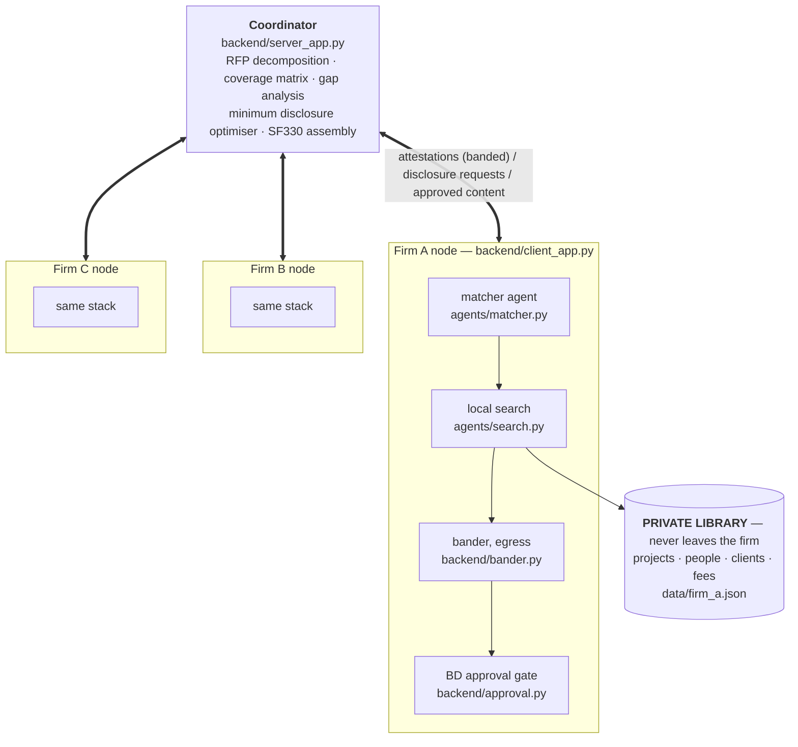

# Consortium — a collaborative disclosure harness for Flower Agents

**Collaborative Agent Hackathon — Flower Labs, University of Cambridge, Wed 26 Aug 2026**
**Track 1: SuperGrid** — *"showcase the collaborative aspect of Flower Agents running on
SuperGrid."* We build that as an agent **harness**: *"Agents can significantly accelerate
our work; how would collaborative agents multiply that?"*

Reference application: AEC qualifications packages (SF330), grounded in the
OpenAsset / Axomic workflow.

---

## 0. The track, and what we must hand in

The track asks for **a new agent harness that runs on SuperGrid and is published on Flower
Hub, showcasing the collaborative aspect of Flower Agents.** That phrasing sets two
pass/fail gates and six scored axes. Everything in this document is arranged around them.

### 0.1 Submission gates — binary, not scored

| Gate | Evidence | Owner | Deadline |
|---|---|---|---|
| **Published Flower Hub app** | live URL `flower.ai/apps/<account>/consortium/`, runnable by a judge | Flower | **11:30 stub, 16:30 final** |
| **Open-source repo** | public GitHub, Apache-2.0, `LICENSE` file present | all | 16:50 |

Neither is a demo feature. A perfect demo with no published app does not qualify. §10 is
the publishing runbook; **T0 in §11 clears both gates before we write scenario code.**

The organisers' own wording — schedule, venue, Slack channel, required reading, the shared
model endpoints and their 5-minute task timeout, the submission fields, and the six judging
axes — is in `event.md`. Read it once.

### 0.2 Scored axes, and the artefact that evidences each

| Axis | Our evidence | Where it lives |
|---|---|---|
| **Impact** | JVs bid federal work by emailing spreadsheets; the harness is the missing primitive | §1 pitch, §14 roadmap |
| **Innovation** | not retrieval — a *constrained disclosure optimiser* with a human gate | §5.4 optimiser |
| **Flower** | genuine `AgentApp` on SuperGrid, published to Hub, run from `flwr chat` | §6 mapping, §10 runbook |
| **Execution** | it runs end to end, live, and the three-condition baseline table is real | §7 evaluation |
| **Presentation** | 4-minute table demo, rehearsed twice, with one scripted reaction beat | §8 demo |
| **Safety** | banded egress, reject-not-sanitise, per-record human authorisation, 0-byte proof | §5.2, §7.2 |

**Safety is a scored axis, not a compliance chore.** We happen to have built the most
defensible safety story in the room — surface it deliberately (§7.2), do not let it stay
implicit in the schema.

### 0.3 The clock

| Time | Event |
|---|---|
| 17:30 | **Demos ready.** Judges come to the table. |
| — | 3–5 minutes each, at the table, conversational |
| 18:45 | Winners announced; top 3 present on stage |

Working backwards: code freeze **16:50**, final Hub publish **16:30**, two timed rehearsals
between 16:50 and 17:30.

---

## 1. The pitch

Large federal infrastructure work is bid by **joint ventures**: three or four architecture
and engineering firms partner on a single pursuit, each contributing project qualifications
and key personnel. Those same firms compete against each other on the next three pursuits.

So every JV has an awkward problem. To produce a compliant SF330 the partners must
establish, together, that the team covers every requirement in the solicitation. But a
firm's full project history exposes its client relationships and contract values, and its
full roster is a recruiter's shopping list. Today this is solved by emailing spreadsheets
around and hoping.

Consortium is **a harness for agents that are not allowed to pool their data.** It puts an
agent next to each party's private library and gives those agents a protocol: establish
compliance by exchanging **attestations** — banded, anonymised evidence that a matching
record exists — never the records; broadcast the *gap* rather than the answer so each agent
re-queries its own data with a question it did not know to ask; then compute the *minimum
set of disclosures* that closes the gap, and route each one through a human owner.

SF330 bid assembly is the reference application shipped with it. The harness is the
deliverable.

**One-line demo:** *three firms discover their joint bid is non-compliant, fix it, and
assemble the SF330 — while each firm releases nine records out of forty and never names
its confidential clients.*

### 1.1 Why this is a harness and not an app

A harness is the part someone else can reuse. Strip out SF330 and what remains is a
four-stage collaboration protocol with no domain in it:

```
attest  ->  detect gap  ->  re-examine locally against the gap  ->  minimise disclosure, gate on a human
```

That loop applies unchanged to any set of parties who must jointly prove a property they
cannot each verify alone and cannot pool data to check: consortium bids, multi-hospital
cohort feasibility, cross-bank sanctions triage, supply-chain conformance. The domain
enters only through three pluggable pieces — a requirement set, a closed banding
vocabulary, and a disclosure-cost function. That separation is the reason this belongs on
Hub rather than in a repo.

Say this sentence in the demo: **"the SF330 is the example; the harness is the product."**

---

## 2. The design constraint

> **No single firm can assess whether the JV is compliant.**

Each firm sees only its own coverage, systematically overestimates its contribution, and
cannot know which of its assets are actually load-bearing. The federated coverage matrix is
the only artefact that reveals the true gap.

If any one firm can determine compliance alone, the system did not need to be distributed.
The synthetic corpora are engineered backwards from this.

This is also the answer to the track's own question. Collaborative agents do not multiply
because three copies work faster; they multiply because **agent B answers a question agent
A could not know to ask.** Round 2 is that claim, made executable.

---

## 3. Why SF330 is the right reference application

The form is structurally a gift:

| Section | Content | Why it matters here |
|---|---|---|
| **E** | Resumes of key personnel | Your "employee bios" workflow |
| **F** | Example projects — **maximum 10** | Your "project sheets" workflow; the cap forces selection |
| **G** | Matrix: which key person worked on which example project | The join — and the source of the demo moment |

Section G is the crux. It is not enough to have healthcare people and seismic people. The
matrix demands *this named individual, on that named project*. Firms routinely believe they
are covered at the aggregate level and are not covered at the cell level.

The Section F cap of ten projects is what turns disclosure into an optimisation problem
rather than a dump.

---

## 4. The scenario

**Solicitation:** federal healthcare facility, seismic zone, design-build.

**The JV:** Firm A (large multidisciplinary, healthcare-heavy), Firm B (structural
specialist, seismic-heavy), Firm C (mid-size regional, strong federal past performance).

**Requirements (abbreviated):**

| ID | Section | Kind | Predicate | Min count |
|---|---|---|---|---|
| R1 | F | MANDATORY | sector=healthcare, value >= $50M, completed <= 7 yrs | 3 |
| R2 | F | MANDATORY | delivery=design-build, federal client | 2 |
| R3 | E | MANDATORY | role=PM, credential=PMP, healthcare experience | 1 |
| R4 | G | MANDATORY | **one person with healthcare AND seismic retrofit** | 1 |
| R5 | E | WEIGHTED | role=structural lead, credential=SE | 1 |
| R6 | F | WEIGHTED | LEED Gold or better | 2 |

**The engineered gap: R4.** Firm A has healthcare personnel. Firm A has seismic
personnel. Firm A has nobody who is both — and does not realise this, because its internal
view is by discipline, not by the Section G cell. Firm B has exactly one such person, on a
project Firm B classified as "structural retrofit" and would never have volunteered against
a healthcare requirement.

Nobody finds R4 alone. The federated round finds it.

---

## 5. Architecture

### 5.1 Components



The coordinator lives in `backend/`, the matcher in `agents/`, and the private libraries
in `data/` — one file per firm, read only by that firm's node. Directory ownership and
the rules for working across it are in `CLAUDE.md` at the repo root.

### 5.2 The attestation schema — the privacy boundary

The schema is the guarantee, and it is the core of the **safety** story. A struct that
structurally cannot carry a client name, a fee, or a person's identity. It ships as
`backend/schema.py` and is **frozen at 11:20** — every other task depends on it.

```python
from dataclasses import dataclass, field
from typing import Literal

AssetKind = Literal["PROJECT", "PERSON"]

@dataclass
class Attestation:
    handle: str                   # "FIRM_B::PERSON::007" — opaque, firm-local
    firm: str
    kind: AssetKind
    requirement_id: str           # which requirement this answers
    match_strength: float         # 0-1
    banded: dict[str, str]        # ONLY banded values, closed vocabulary:
                                  #   value_band: "50-100M" | "100-250M" | ...
                                  #   recency_band: "0-3y" | "3-7y" | "7y+"
                                  #   sector: closed set
                                  #   credentials: closed set
                                  #   delivery: closed set
    disclosure_cost: int          # 0 free | 1 NDA-limited | 2 competitively sensitive
                                  # | 3 blocked (will never be released)
    links: list[str] = field(default_factory=list)
                                  # same-firm handles only: person <-> project,
                                  # enabling Section G cells without naming anyone
    note: str = ""                # <=120 chars, passes bander validator
```

**Enforced invariants (the bander):**

- every key in `banded` must be in the closed vocabulary; unknown keys **rejected**, not
  dropped
- no free-form client names, project titles, or person names in any round-1 or round-2 field
- exact contract values banded before they leave the node; exact dates banded to ranges
- `note` capped at 120 chars, regex-scrubbed for proper nouns, currency figures, and
  anything shaped like an address
- `links` restricted to same-firm handles — a firm cannot assert facts about another firm
- outbound byte counter, displayed live in the demo

**Key property:** the coordinator can compute the full coverage matrix and prove compliance
or non-compliance from attestations alone, before any record is disclosed.

**Reject, do not sanitise.** A sanitising egress filter teaches an agent that leaky output
is acceptable and silently ships whatever the regex missed. A rejecting one fails the
attestation and makes the agent try again within the vocabulary. This distinction is worth
one sentence to the judges — it is the difference between a guardrail and a filter.

### 5.3 The round protocol

**Round 1 — decomposition and blind bidding**

Coordinator parses the solicitation into typed `Requirement` objects and broadcasts them.
Each firm agent searches its own library and returns attestations. Coordinator builds the
coverage matrix.

*Expected output:* R4 uncovered. Every firm privately believes the JV is fine.

**Round 2 — re-examination in light of the gap** <- the make-or-break feature

Coordinator broadcasts the *gap*, not the answer: "R4 uncovered — need one individual with
both healthcare and seismic retrofit evidence, Section G cell."

Each firm now re-queries **its own library** with a question it did not know to ask in
round 1. Firm B's agent, prompted by the cross-cutting framing, re-reads a bio it had
classified as purely structural and finds a hospital wing retrofit buried in the project
history. It emits a new attestation with a `links` entry joining person to project.

*Local recompute informed by global state, iterated over rounds.* Say it in the pitch —
this audience reads it immediately as the shape of federated learning, and it is the
literal answer to "showcases the collaborative aspect".

**Round 3 — minimum disclosure and human approval**

Coordinator solves for the cheapest set of disclosures satisfying all MANDATORY
requirements within the Section F cap of ten projects. It requests full content on only
those handles. **Each firm's BD lead approves or denies each request individually.** On a
denial the optimiser re-runs and finds the next-cheapest substitute. Approved content flows
back; the SF330 assembles.

### 5.4 The disclosure optimiser

Weighted set cover, solved greedily. Deterministic, explainable, and fast.

```
minimise   sum( disclosure_cost(h) for h in chosen )
subject to every MANDATORY requirement r:
               count( h in chosen : covers(h, r) and strength(h,r) >= tau ) >= min_count(r)
           |{h in chosen : h.kind == PROJECT}| <= 10        # SF330 Section F cap

greedy step: pick h maximising
             (newly covered requirement-slots, weighted by requirement weight)
             / (disclosure_cost(h) + 1)
```

The `+1` keeps free records preferred but not free-only; the weighting is what produces the
"found a cheaper substitute" beat. Cost 3 (blocked) handles are excluded from the candidate
set entirely — the firm's agent never even offers them.

**Deliverable metric:** *compliance achieved, disclosure minimised.* Two axes, and you win
on both.

---

## 6. Flower mapping

Verified against the installed `flwr 1.34.0`, not from memory.

| Concept | Flower construct |
|---|---|
| **Harness entry point, published to Hub** | `AgentApp` — `[tool.flwr.app.components] agentapp = "backend.agent_app:app"` |
| Harness body | `@app.main()` over `(agent: AgentSession, context: Context)` |
| Every model call in every agent | `agent.responses.create({...})` — Open Responses shape, supports `"stream": True` |
| Tool access for an agent | `agent.connectors.tools([...])` / `agent.connectors.call(...)` |
| Operator input (the solicitation) | `context.run_config["agent.input"]`, declared as `[tool.flwr.app.config.agent] input = ""` |
| Invocation on SuperGrid | `flwr chat` -> `@<publisher>/consortium <solicitation>` |
| Per-firm node holding a private library | `ClientApp` (federated path, `flwr run .`) |
| Coordinator round loop | `ServerApp` (federated path) |
| Attestation / request / content transport | `RecordDict` -> `ConfigRecord` / `MetricRecord` |

### 6.1 The one architectural decision — resolve it by 12:00

`flwr` validates an app as an **agentapp bundle** the moment `agentapp` appears in
`[tool.flwr.app.components]`; `serverapp` and `clientapp` then stop being required. Whether
one FAB may usefully carry *all three* is not documented, and we are not going to find out
at 16:00.

**Plan of record — ship both surfaces, test the combination first:**

- `agentapp = "backend.agent_app:app"` — the harness as a Flower Agent. This is what gets
  published, what runs on SuperGrid, and what a judge can invoke from `flwr chat`.
- `serverapp` / `clientapp` — the federated simulation, `flwr run .`, three supernodes,
  genuine per-node data isolation. This is the demo we drive at the table because it is
  local and cannot be taken out by venue wifi.

**T0 tests this exact combination in one pyproject at 11:00, with stub bodies, before any
scenario code exists.** If the runtime rejects it, the fallback is decided in advance and
costs twenty minutes: keep the root project as the federated app, and publish the agentapp
from `hub/` as a second project directory (`flwr app publish hub/`) that imports `backend`
and `agents`. Do not discover this at 16:00.

### 6.2 Dual-runtime compatibility is a Hub requirement

A published app must run in **both** simulation and deployment without code changes. The
documented discriminator is `context.node_config`:

```python
if "partition-id" in context.node_config and "num-partitions" in context.node_config:
    library = load_sim_library(context.node_config["partition-id"])   # data/firm_{a,b,c}.json
else:
    library = load_local_library(context.node_config["library-path"]) # real SuperNode
```

This lands in `backend/client_app.py` and costs about eight lines. Write it at T3, not
after the first Hub reviewer runs the app on a real federation and it dies.

---

## 7. Evaluation — the 20 minutes that probably wins it

### 7.1 The three conditions

| Condition | Data access | Compliant? | Records disclosed |
|---|---|---|---|
| **Isolated** — each firm self-assesses | own library | **No** — R4 gap undetected, all three firms believe otherwise | 0 |
| **Consortium** — federated attestation | own library + peer attestations | **Yes** | **9** |
| **Centralised pool** — all libraries in one index | everything | Yes | **~40** (full exposure) |

The claim: Consortium **matches the centralised oracle's compliance at roughly a fifth of
the disclosure**, and the isolated baseline is not merely worse — it is confidently wrong.

That "confidently wrong" row is the most persuasive line in the deck. Hackathon judges
almost never see an actual evaluation. Budget the 20 minutes; cut UI polish before this.

### 7.2 The safety ledger — a scored axis, so make it an artefact

Safety here is not "we thought about privacy". It is four numbers the harness prints at the
end of every run, and every one of them is checkable on the spot:

| Claim | Instrument | Demo value |
|---|---|---|
| No raw record left a node before authorisation | outbound byte counter in `backend/bander.py` | **0 bytes** |
| No confidential client was named | closed-vocabulary validator; unknown key = rejection | **0 names** |
| Every disclosure had a named human approver | per-record approval log in `backend/approval.py` | **9 of 9** |
| A refusal is honoured, not routed around | cost-3 handles never enter the candidate set | **1 denial, 1 substitution** |

Include the **rejection** count too — attestations the bander refused during the run. A
guardrail that never fires is indistinguishable from an absent one, and showing it fired
twice is stronger than claiming it would have.

---

## 8. Demo — 4 minutes at the table

Full beat sheet, the compressed 90-second version, and the stage variant are in
`docs/demo-script.md`. Summary of the shape:

| Time | Beat |
|---|---|
| 0:00–0:30 | The problem, in the judge's language. "Three firms, one federal bid, competitors next month." |
| 0:30–1:00 | **Hub first.** The published app, and `flwr chat @<publisher>/consortium`. Gate cleared in front of them. |
| 1:00–1:45 | Round 1. Coverage matrix fills. Each firm self-assesses *compliant*. Joint matrix: **R4 red**. |
| 1:45–2:30 | Round 2. Gap broadcast; Firm B's agent re-reads its own roster and finds the one person who is both. |
| 2:30–3:15 | Round 3. Optimiser requests 9 of 40. BD lead **denies** one — optimiser substitutes live. |
| 3:15–3:45 | SF330 assembles. Safety ledger: 0 bytes, 0 names, 9 of 9 approved, 2 rejections. |
| 3:45–4:00 | "The SF330 is the example. The harness is the product." Roadmap line. Stop talking. |

Two changes from a stage pitch, both because judges are standing at the table:

- **Lead with the Hub app, not the architecture.** They are ticking a submission gate; give
  it to them in the first minute and the remaining three are yours.
- **Leave silence for questions.** Four minutes of a five-minute slot. §13 is the Q&A prep
  and it is where the marks actually are.

---

## 9. Requirements

### 9.1 Access — verify in the first 30 minutes

`make doctor` checks the local half of this list. The rest is human.

- [ ] **Flower account, and one named person who owns it.** Their username becomes
      `publisher` and cannot be changed later — see §10.3.
- [ ] `flwr login supergrid` succeeds, and `flwr app publish` is permitted for that account
- [ ] Model access confirmed; know the available model strings
- [ ] Fallback direct model API key (SuperGrid contention with ~130 attendees is likely)
- [ ] GitHub repo **public** — it is a submission gate, not a nicety — all teammates pushing
- [ ] Phone hotspot — venue wifi is a known failure mode

### 9.2 Environment

- [ ] Python ≥ 3.13, `uv`, `flwr >= 1.34.0, < 2.0`
- [ ] `make setup` clean, `make doctor` green, `make build` producing a `.fab`
- [ ] `make rounds` executes a no-op round across three supernodes
- [ ] Hello-agent tutorial run end to end **before writing any project code**

Everything routes through the Makefile — `make` lists the targets. `make check` (lint plus
the invariant tests) is the gate before every push.

### 9.3 Dependencies

| Package | Purpose | Risk |
|---|---|---|
| `flwr` | rounds, transport, `AgentApp`, Hub publishing | agent runtime is young — hedged §6.1 |
| stdlib `dataclasses` | schema (prefer over pydantic — fewer moving parts) | low |
| `numpy` | optimiser arithmetic | low |
| stdlib `re` | bander scrubbing | low |
| `pytest`, `ruff` (dev group) | the invariant tests and the lint gate | low |

No web framework. No database. No embedding service — see R5 in §12. Every runtime
dependency ends up inside the published FAB, so a dependency added at 15:00 is a
republish, not just a `uv sync`.

### 9.4 Data artefacts — build-day critical path

- [ ] `data/rfp.json` — 6 typed requirements per §4
- [ ] `data/firm_a.json` — ~12 projects, ~8 people
- [ ] `data/firm_b.json` — same, **containing the sole R4 match**
- [ ] `data/firm_c.json` — same
- [ ] `data/vocabulary.json` — closed sets for sector, bands, credentials, delivery
- [ ] `data/ground_truth.json` — true coverage, for scoring the three conditions
- [ ] `data/generate.py` — the scripted generation pass itself

Record shapes for projects and people are fixed in `data/README.md` before generation
starts. `tests/test_invariants.py` guards the two things that break silently — the
vocabulary drifting from `backend/schema.py`, and a corpus edit that closes the engineered
R4 gap. Those tests skip until the corpora land and go live unedited.

**Engineering requirements for the corpora — non-negotiable:**

1. Exactly one person across all three firms satisfies R4, and they are at Firm B.
2. That person's bio describes the hospital work in **non-obvious language** — "acute care
   wing structural upgrade", never "healthcare seismic retrofit" — so round 1 misses it and
   round 2 finds it. This is the single most important sentence in the dataset.
3. Each firm has enough surface coverage to plausibly self-assess as compliant.
4. At least one cost-2 record must be substitutable, or the denial beat fails.
5. 2–3 near-miss distractors per firm (right sector, wrong value band; right credential,
   wrong role) so the matcher has something to correctly reject.
6. Keep each `data/*.json` under 1 MB — the Hub upload rejects a larger file (§10.3).

---

## 10. Publishing to Flower Hub — the runbook

Verified against the Hub docs and the installed CLI. **Owner: Flower. First run at 11:00.**

### 10.1 Commands

```bash
flwr login supergrid                 # browser auth against the Flower account
flwr app publish .                   # uploads SOURCE; Hub builds the FAB server-side
# -> https://flower.ai/apps/<account>/consortium/
```

Publishing a new version is the same command after bumping `version` in `pyproject.toml`.
**Publish early and often** — every increment, all afternoon. The first publish is the risky
one because it exercises the account, the publisher name, the license file and the file
filter all at once; the tenth is free.

Wrap both in the Makefile at T0 so nobody publishes by hand at 16:25: `make publish` should
bump nothing, run `make check`, then `flwr app publish .`. Add `make chat` for the SuperGrid
side of the demo.

### 10.2 `pyproject.toml` deltas required for Hub

Apply these as one edit at T0. The current file satisfies none of them.

```toml
[project]
name = "consortium"
version = "0.1.0"
description = "A collaborative disclosure harness for agents that cannot pool their data"
license = { file = "LICENSE" }          # NOT license = "Apache-2.0" — a table, with a file

[tool.flwr.app]
publisher = "<flower-account-username>"  # MUST equal the account name; "consortium" is wrong
fab-format-version = 1
flwr-version-target = "1.34.0"

[tool.flwr.app.components]
agentapp = "backend.agent_app:app"
serverapp = "backend.server_app:app"
clientapp = "backend.client_app:app"

[tool.flwr.app.config.agent]
input = ""
```

Two knock-on effects the Flower owner should expect from that edit. `make doctor` prints
`components['serverapp'] / components['clientapp']` directly and will need the `agentapp`
key added — if §6.1 forces the agentapp-only fallback, those two keys disappear and the
target raises `KeyError`. And `flwr-version-target` pins the runtime the Hub builds
against, so it must track whatever `make doctor` reports, not whatever this document says.

### 10.3 Constraints that change the plan

| Constraint | Consequence for us |
|---|---|
| `name` **cannot change after first publication** | `consortium` is final from 11:00. Agree it before T0 publishes, not after. |
| `publisher` must equal the Flower account username | Someone owns the account. Name that person at kickoff. |
| `LICENSE` file required for `fab-format-version = 1` | **The repo has none.** Add Apache-2.0 at T0 — it is also the open-source gate. |
| Allowed extensions: `.py .toml .md .yaml .json .jsonl`, LICENSE, `.gitignore`, `.editorconfig` | **`frontend/` HTML, CSS and JS are silently excluded from the published app.** See below. |
| 1,000 files, 1 MB per file, 10 MB total | Our corpora are far inside this. Keep each `data/*.json` under 1 MB anyway. |
| Files deeper than 10 directory levels are excluded | Not a risk with the current layout. |
| `.gitignore` patterns filter the upload | `frontend/state/` is gitignored, so run state never ships. Correct. |

**The frontend finding matters.** A judge who installs the app from Hub gets no HTML. So
the harness's *primary* output must be a legible terminal / Markdown report written by
Python — the coverage matrix, the ledger and the SF330 sections all render as text. The
`frontend/` page is a local demo skin over the same JSON, not the product surface. This
re-scopes T13/T14: **make the text renderer first, the HTML second.** The text renderer is
what ships; the HTML is what cuts.

---

## 11. Task breakdown

Assumes 4 people. With 3, drop the viz owner; the pitch still gets a named owner.

| # | Task | Owner | Where it lands | Window | Blocks |
|---|---|---|---|---|---|
| **T0** | **Hub beachhead.** Flower account, `flwr login supergrid`, `LICENSE`, pyproject per §10.2, stub `agentapp`+`serverapp`+`clientapp` in one FAB, `flwr app publish .`, run it from `flwr chat`. | Flower | `pyproject.toml`, `LICENSE`, `backend/agent_app.py` | **10:45–11:30** | **submission** |
| T1 | Align on scenario + attestation schema. Everyone can state the demo moment in one sentence. | all | `backend/schema.py` | 11:00–11:20 | everything |
| T2 | **Synthetic corpora + RFP + vocabulary** (scripted LLM pass, fixed schema first) | Data | `data/` | 11:20–12:10 | T4, T7 |
| T3 | Repo skeleton, dual-runtime `node_config` branch (§6.2), `flwr run` executing a no-op round | Flower | `backend/client_app.py` | 11:30–12:15 | T5 |
| T4 | Local search + structured predicate matcher | Agent | `agents/search.py` | 12:10–13:00 | T6 |
| T5 | Attestation serialisation into `RecordDict`, both directions | Flower | `backend/transport.py` | 12:15–13:30 | T7 |
| T6 | Matcher agent prompt, round-1 attestation emission, via `agent.responses.create` | Agent | `agents/matcher.py`, `agents/prompts/` | 13:00–14:15 | T7 |
| T7 | **End-to-end round 1 + coverage matrix, R4 showing red** | Flower+Agent | `backend/coverage.py`, `backend/server_app.py` | -> 15:00 | T8 |
| T8 | **Round 2 re-examination** — gap-directed local re-query | Agent | `agents/reexamine.py` | 15:00–16:00 | demo |
| T9 | Bander + byte counter + rejection counter | Flower | `backend/bander.py` | 13:30–14:00 | T12 |
| T10 | Disclosure optimiser (greedy weighted set cover) | Fusion | `backend/optimiser.py` | 12:00–14:30 | T11 |
| T11 | Approval gate + denial-and-substitute re-run | Fusion | `backend/approval.py` | 14:30–15:15 | demo |
| T12 | Three-condition baseline harness + safety ledger (§7.2) | Fusion | `backend/baselines.py` | 15:15–16:00 | demo |
| T13 | **Text** renderer: coverage matrix, ledger, SF330 — the shipped surface (§10.3) | Viz | `backend/render.py` | 13:30–15:00 | demo |
| T14 | HTML skin over the same JSON — the local demo surface | Viz | `frontend/` | 15:00–16:00 | cut candidate |
| T15 | Hub app README + description; the page a judge lands on | Viz | `README.md`, Hub metadata | 15:00–16:00 | submission |
| **T16** | **Final publish.** Bump version, `flwr app publish .`, verify the live URL from a clean shell. | Flower | Hub | **16:15–16:30** | **submission** |
| T17 | Slides / talking points: problem, harness, baselines, safety, roadmap | Viz | `docs/` | 15:00–16:50 | demo |
| T18 | **Code freeze.** Rehearse twice, timed, against §8. | all | `docs/demo-script.md` | 16:50–17:30 | — |

### Milestones

- **11:20** — schema frozen. T2 cannot start until it is, and T2 is critical path.
- **11:30** — **stub app live on Hub and runnable on SuperGrid.** Both submission gates
  provisionally cleared. If this is not green, everyone stops and helps until it is.
- **12:00** — agentapp-plus-federated-in-one-FAB decision settled (§6.1). No further
  packaging debate after this point.
- **13:00** — corpora committed. If not, cut to two firms and 6 projects each **immediately**.
- **15:00** — round 1 end to end with the matrix rendering as text.
- **16:00** — round 2 converges and closes R4. This is the demo; protect this hour above all.
- **16:30** — **final version published to Hub and verified from a clean shell.**
- **16:50** — freeze. Nothing merges after.
- **17:30** — demos ready.

### Cut list, in strict order

1. HTML skin -> text renderer only (already the shipped surface, so this costs nothing)
2. Coverage matrix animation -> static table per round
3. Approval gate UI -> `input("approve disclosure of FIRM_A::PROJ::014? [y/N] ")`
4. Denial-and-substitute beat -> single-pass optimiser
5. Centralised-pool baseline -> keep isolated vs. federated
6. Three firms -> two firms (**degrades the story badly — near-last resort**)

**Never cut round 2.** Without gap-directed re-examination this is federated RAG with extra
steps, which is exactly the criticism to avoid.

**Never cut the Hub publish.** It is not a feature, it is the entry ticket. If the choice at
16:20 is between a working denial beat and a published app, publish.

---

## 12. Risk register

| # | Risk | Likelihood | Impact | Mitigation |
|---|---|---|---|---|
| R0 | **Hub publish fails late** — wrong publisher, missing LICENSE, file filter, name clash | **High** | **Fatal** | T0 at 10:45. Publish a stub before writing scenario code, then republish all afternoon. Never first-publish after 12:00. |
| R1 | Reads as "federated RAG" | **High** | **High** | Lead the pitch with the disclosure optimiser and the human gate, not retrieval. The optimiser is the novel artefact — demo it before the search. |
| R2 | Round 2 fails to surface the R4 match | Med | **Critical** | The bio wording is a tuning parameter, not fixed data. If it misses by 15:45, edit the corpus, not the prompt. |
| R3 | Corpora slip past 13:00 | **High** | High | Fix schema first, script the generation, cut to two firms on the milestone without debate. |
| R4 | `agentapp` + `serverapp`/`clientapp` in one FAB is unsupported | Med | High | §6.1 — tested at T0 with stubs; pre-decided fallback is a second project dir published separately. |
| R5 | LLM call volume — naive matching is 60 records x 6 requirements | Med | Med | Structured predicate prefilter on banded fields; invoke the model only on the shortlist and only for free-text bios. Target <= 50 calls per full run. |
| R6 | Venue wifi / SuperGrid contention with ~130 attendees | High | Med | Hotspot; cache model responses during development. **Drive the table demo from the local simulation**, and show the Hub app as an artefact rather than depending on a live SuperGrid round at 17:30. |
| R7 | Attestations leak identifying detail | Med | Med | Bander **rejects** rather than sanitises; the rejection counter is a demo asset (§7.2). |
| R8 | SF330 unfamiliar to a UK audience | Med | Low | Ten seconds of framing: "US federal qualifications form — Section G is a person-by-project matrix." Do not explain more. |
| R9 | Reads as one app, not a reusable harness | Med | **High** | §1.1. Name the three pluggable pieces out loud; say "the SF330 is the example, the harness is the product". |

R0, R1 and R3 decide this project. R0 is on the critical path from minute one and is the
only one that is unrecoverable.

---

## 13. Judge Q&A prep

**"Isn't this just federated retrieval?"**
Retrieval establishes what exists. The contribution is deciding what to *reveal*: a
constrained optimisation over disclosure cost, subject to a compliance requirement and a
hard cap on Section F entries, with per-record human authorisation. Remove the optimiser
and the firms are back to disclosing everything.

**"What makes this a harness rather than an application?"**
Three pluggable pieces and nothing else is domain-specific: a requirement set, a closed
banding vocabulary, and a disclosure-cost function. Swap those and the same four-stage loop
runs cross-hospital cohort feasibility or supply-chain conformance. That is why it is on
Hub — someone else installs it and brings their own three.

**"The coordinator sees all attestations — that's centralisation."**
Same relationship as gradients to training data. Attestations are banded, anonymised
existence proofs bounded by a closed vocabulary; the coordinator can prove compliance
without being able to identify a single client, fee, or person. The optimiser is
associative and can be run hierarchically or peer-to-peer with no protocol change.

**"Why not pool the libraries into one index?"**
We ran it — the centralised-pool row. It reaches the same compliance and requires roughly
forty records of exposure to competitors, which is why no firm does it. We match its
compliance at nine.

**"Is this multi-agent, or one agent called three times?"**
The agents hold disjoint tool access; none can query another's library. Round 2 changes each
agent's *local* behaviour based on the global gap — they ask their own data new questions.
Remove peer state and all three firms self-certify as compliant and are wrong, which we
show as our first baseline.

**"Why Flower rather than LangGraph?"**
LangGraph orchestrates agents inside a trust domain. Here the premise is that no such domain
exists — the participants are active competitors. Round-based coordination across nodes
that cannot share state is precisely Flower's primitive.

**"How do collaborative agents multiply the work, rather than just parallelise it?"**
Parallel agents each answer their own question faster. These answer a question none of them
could pose: Firm B's agent only finds the R4 person because the coordinator told it about a
gap that exists in Firm A's coverage. The information that unlocks the search is held by a
party that cannot see the data the search runs over. That is the multiplier.

**"What is the safety story?"**
Four instrumented claims, printed at the end of every run: zero raw bytes out before
authorisation, zero confidential names in any attestation, every disclosure carries a named
human approver, and refusals are honoured by re-planning rather than routed around. Plus a
rejection counter, so you can see the guardrail actually fired.

**"Does it really run on SuperGrid?"**
It is published at `flower.ai/apps/<account>/consortium` and invoked with
`flwr chat @<publisher>/consortium`. We drive the table demo from the local simulation for
reliability with 130 people on the venue wifi, not because the deployment path is a mock.

---

## 14. Roadmap slide (say it, do not build it)

Every completed pursuit is a labelled example: this evidence set, against this solicitation,
won or lost. Firms federate a **win-rate prior** over requirement-to-evidence matching —
learning which qualification patterns actually convert — without any firm exposing its bid
history or its losses.

That is federated learning over commercial outcomes, in a market where nobody will ever
pool the data. It is also a product Axomic could plausibly ship.

---

## Appendix: repo layout

```
consortium/
├── CLAUDE.md                     # working agreement: worktrees, one branch, ownership
├── LICENSE                       # Apache-2.0 — required by Hub, required by the open-source gate
├── README.md                     # also the Hub app landing copy — T15
├── Makefile                      # make demo, make check, make publish — `make` lists the rest
├── pyproject.toml                # agentapp + serverapp + clientapp; Hub metadata per §10.2
├── data/                         # Data owner — T2
│   ├── README.md                 # record shapes + the non-negotiable corpus rules
│   ├── rfp.json                  # 6 typed requirements per §4
│   ├── vocabulary.json           # closed sets: sector, bands, credentials, delivery
│   ├── firm_a.json               # private library, one file per firm
│   ├── firm_b.json               #   — holds the sole R4 match
│   ├── firm_c.json
│   ├── ground_truth.json         # true coverage, for scoring the three conditions
│   └── generate.py               # scripted LLM generation pass
├── backend/                      # Flower + Fusion owners
│   ├── agent_app.py              # AgentApp entry point — the harness, published to Hub — T0
│   ├── schema.py                 # Requirement, Attestation, closed vocabulary — frozen 11:20
│   ├── bander.py                 # egress validator + outbound byte and rejection counters
│   ├── transport.py              # Attestation <-> RecordDict, both directions
│   ├── server_app.py             # coordinator: decomposition, round loop, gap broadcast
│   ├── client_app.py             # firm node: dual-runtime library load, agent dispatch, gate
│   ├── coverage.py               # coverage matrix, gap analysis
│   ├── optimiser.py              # greedy weighted set cover under the Section F cap
│   ├── approval.py               # BD approval gate, denial-and-substitute re-run
│   ├── assemble.py               # SF330 Sections E / F / G
│   ├── render.py                 # text/Markdown renderer — the surface that ships — T13
│   └── baselines.py              # isolated / consortium / centralised-pool + safety ledger
├── agents/                       # Agent owner
│   ├── search.py                 # structured predicate prefilter over banded fields
│   ├── matcher.py                # round-1 matching, attestation emission
│   ├── reexamine.py              # round-2 gap-directed re-query — never cut
│   ├── model.py                  # agent.responses.create wrapper + response cache
│   └── prompts/
│       ├── round1_match.md
│       └── round2_reexamine.md
├── frontend/                     # Viz owner — local demo skin, EXCLUDED from the Hub app
│   ├── index.html                # coverage matrix, disclosure ledger, SF330
│   ├── app.js
│   ├── styles.css
│   └── state/                    # run state written by the backend, gitignored
├── tests/                        # everyone
│   └── test_invariants.py        # schema vs data, and the engineered R4 gap
└── docs/
    ├── consortium-brief.md       # this document
    ├── demo-script.md
    └── decisions.md
```

Each directory carries a README naming its modules, the task that owns each one, and the
invariants that hold there. `backend/` and `agents/` are the two importable packages; the
dependency runs one way — `agents` imports `backend.schema` and nothing else from it.
