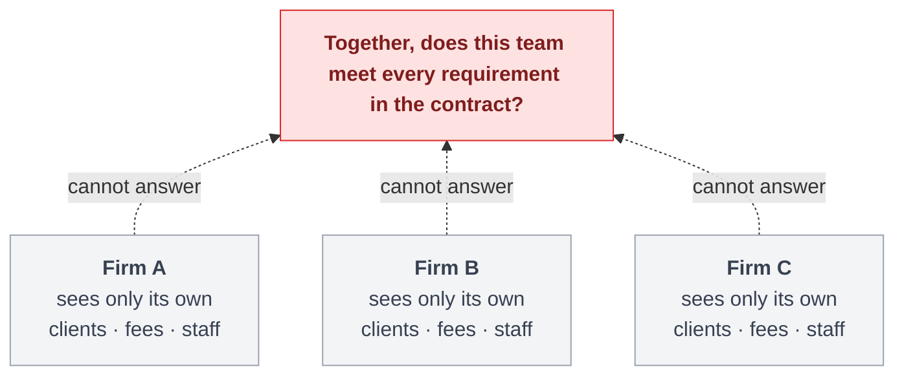
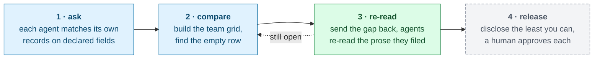

# Consortium

<div class="mt-6 text-2xl leading-relaxed">
Three firms have to prove their joint bid qualifies.<br>
None of them will show the others their data.
</div>

<div class="mt-10 text-lg opacity-80">
This is the protocol that settles it. No record moves.
</div>

<div class="mt-14 text-sm opacity-50">
Track 1 — SuperGrid &nbsp;·&nbsp; <code>flwr chat</code> → <code>@i53n1/consortium</code>
</div>

<!--
Read the two lines and stop. Everything else is on the next slide as a picture.

The through-line to say here, and to land on again when the six slides run out: the bidding
form is the example, the harness is the product.
-->

---
layout: center
class: text-left
---

# One contract. Three firms. Nobody can check.



<div class="cap mt-2">

Work too big for one firm gets bid by three. The client wants one proof that the
**whole team** qualifies. They compete against each other next month, and today that proof is
assembled by emailing spreadsheets.

</div>

<!--
Impact axis, and the slide that has to land. Say it in the judge's own language: a hospital,
a tunnel, an airport - too big for one firm, so three of them bid it as a team.

The tension in one sentence: to prove the team qualifies they would each have to hand over the
client list, the fee history and the staff roster they are about to compete with.

Do not say "joint venture", "solicitation" or "SF330" yet. None of those words earn anything
in the first minute.
-->

---
layout: center
class: text-left
---

# What the database fields can prove

<div class="sub">every firm searching its own records, matched on declared fields only</div>

<div class="fields">

<div></div>
<div class="hd">Firm A</div>
<div class="hd">Firm B</div>
<div class="hd">Firm C</div>

<div class="rq"><span class="rid">R1</span>Hospital projects over $50m</div>
<div class="ok">✓</div><div class="ok">✓</div><div class="ok">✓</div>

<div class="rq"><span class="rid">R2</span>Design-build, federal client</div>
<div class="ok">✓</div><div class="ok">✓</div><div class="ok">✓</div>

<div class="rq"><span class="rid">R3</span>Project manager with hospital work</div>
<div class="ok">✓</div><div class="ok">✓</div><div class="ok">✓</div>

<div class="rq hot"><span class="rid">R4</span>One person: hospital <i>and</i> earthquake retrofit</div>
<div class="maybe">?</div><div class="maybe">?</div><div class="maybe">?</div>

<div class="rq"><span class="rid">R5</span>Chartered structural lead</div>
<div class="ok">✓</div><div class="ok">✓</div><div class="ok">✓</div>

<div class="rq"><span class="rid">R6</span>Green-certified projects</div>
<div class="ok">✓</div><div class="ok">✓</div><div class="ok">✓</div>

</div>

<div class="legend">
<div><span class="ok">✓</span> the fields settle it</div>
<div><span class="maybe">?</span> the fields cannot say either way</div>
</div>

<div v-click class="cap mt-3">

Five rows are settled by the fields at every firm. The fourth one the fields cannot answer, so
the coordinator records it as an open gap. **An open gap is not the same as nobody having it.**

</div>

<style>
.sub { font-size: 0.85rem; opacity: 0.6; margin-top: 0.2rem; }
.fields {
  display: grid;
  grid-template-columns: 1fr 6.5rem 6.5rem 6.5rem;
  column-gap: 0.7rem;
  row-gap: 0.28rem;
  align-items: center;
  margin-top: 0.9rem;
}
.hd {
  text-align: center;
  font-size: 0.78rem;
  font-weight: 700;
  opacity: 0.55;
  letter-spacing: 0.08em;
  text-transform: uppercase;
}
.rq {
  font-size: 1rem;
  line-height: 1.25;
  border-left: 3px solid transparent;
  border-radius: 0 0.25rem 0.25rem 0;
  padding: 0.25rem 0 0.25rem 0.6rem;
  /* A band per row: the mark columns sit ~190px right of the longest label, and the eye needs
     something to track across. */
  background: #f7f8f9;
}
html.dark .rq { background: rgba(255, 255, 255, 0.04); }
.rid {
  display: inline-block;
  width: 2.2rem;
  font-size: 0.72rem;
  font-weight: 700;
  opacity: 0.4;
}
/* The one row the fields cannot settle carries the accent, so the eye lands there before the
   presenter says anything. The three amber cells to its right complete the band. */
.rq.hot { border-left-color: #d97706; background: #fffbeb; font-weight: 700; }
html.dark .rq.hot { background: #3d3218; }
.fields .ok, .fields .no, .fields .maybe { font-size: 1.1rem; padding: 0.28rem 0; }
.legend { display: flex; gap: 2.5rem; margin-top: 0.85rem; font-size: 0.82rem; opacity: 0.75; }
.legend > div { display: flex; align-items: center; gap: 0.55rem; }
.legend span { padding: 0.12rem 0.6rem; font-size: 0.88rem; }
</style>

<!--
This is the design constraint, and the corpora are built backwards from it.

Say "on the fields alone" out loud. The grid is what a structured search returns, NOT what the
firms hold, and the next slide turns on that difference. A judge who reads this grid as
"nobody has such a person" will think round 2 contradicts it.

The row ids are the ones the log and the live page print, so R4 said here is R4 there.

Careful with the wording in the other direction too: it is NOT "each firm thinks it is fine
and is wrong". Verified off the run - round 1 has have=0 on that row, and every firm alone
clears the other five.
-->

---
layout: center
class: text-left
---

# Firm B had the person all along

<div class="text-xs opacity-55 mt-1">one record at Firm B, read two ways</div>

<div class="grid grid-cols-2 gap-6 mt-3">
<div>

### on file — what round 1 matched

```text
person   FIRM_B::PERSON::007
role     structural lead
sector   civic        <- not healthcare
```

<div class="mt-2 text-xs opacity-70">The predicate needs <code>sector=healthcare</code>. This record fails it, so round 1 never even offers it to a model.</div>

</div>
<div v-click>

### in prose — what round 2 read

<div class="tile">
"… <b style="display:inline">seismic</b> base isolation and strengthening on an
<b style="display:inline">acute care wing</b> upgrade …"
</div>

<div class="mt-2 text-xs opacity-70">A hospital wing, filed as civic work by a firm that saw a concrete frame and a city client.</div>

</div>
</div>

<div v-click class="mt-5">

<div class="text-xs opacity-55 mb-1">the fourth row, both ways</div>

<div class="grid grid-cols-[13rem_4.5rem_4.5rem_4.5rem] gap-x-3 gap-y-1 text-sm">
<div></div>
<div class="text-center text-xs font-bold opacity-60">Firm A</div>
<div class="text-center text-xs font-bold opacity-60">Firm B</div>
<div class="text-center text-xs font-bold opacity-60">Firm C</div>

<div>matched on fields</div>
<div class="maybe">?</div><div class="maybe">?</div><div class="maybe">?</div>

<div>read in the bios</div>
<div class="no">✗</div><div class="ok">✓</div><div class="no">✗</div>
</div>

</div>

<!--
This slide is the answer to "wait, you said nobody had one". Firm B held the person the whole
time. `agents/search.py` is a structured predicate over declared banded fields, and
`agents/matcher.py` grades what that prefilter admits without being allowed to add to it, so a
record filed `sector: civic` never reaches a model in round 1. In the trace it is one field:
round 1 broadcasts `reads_text: false`, round 2 broadcasts `reads_text: true`.

Why round 1 does not just read everything: cost. Matching six predicates over a library is
cheap; reading every paragraph against every requirement is the expensive half, and the joint
grid is what licenses spending it on exactly one requirement.

Two glosses for anyone outside construction, ten seconds: seismic means earthquake, and a
retrofit is strengthening a building that already stands. The fourth row is SF330 Section G,
the person-by-project grid on the US federal form every bid team files.
-->

---
layout: center
class: text-left
---

# The loop



<div class="cap mt-3">

Stages 1–3 run today. Stage 4 is the dashed box: designed, specified, not built.
Nothing in the loop is about construction. The domain enters through three pluggable pieces: a
requirement list, a fixed vocabulary, and a cost per disclosure.

</div>

<!--
Innovation axis, and the answer to "isn't this just federated retrieval?" Retrieval settles
what exists. This settles what to reveal, and it broadcasts the question rather than the
answer.

Stage 3 is where the whole claim sits, and the number to have ready is two bytes: the string
"R4". Not which firm has the hole, not what would fill it. The coordinator does not know which
firm can close it, and Firm B's agent re-read its own bios on the strength of two bytes about
somebody else's coverage. The line the log prints:

  firm B  R4 <- FIRM_B::PERSON::007 - prose details seismic base isolation
          and strengthening on an acute care wing upgrade

Be straight about the dashed box. A judge who catches an overclaim stops believing the rest.
-->

---
layout: center
class: text-left
---

# Architecture

<div class="coordinator">
<b>Coordinator</b>builds the team grid &nbsp;·&nbsp; names the gap &nbsp;·&nbsp; never sees a record
</div>

<div class="flex justify-center gap-14 my-2 text-xs opacity-70">
<div>↓ &nbsp;the requirements, and the gap</div>
<div>↑ &nbsp;banded answers, nothing else</div>
</div>

<div class="boundary">trust boundary</div>

<div class="grid grid-cols-3 gap-4 mt-3">

<div class="firm">
<b>Firm A · SuperNode</b>
<div class="step">private library<div class="opacity-60">projects · people · clients · fees</div></div>
<div class="arrow">↓</div>
<div class="step">agent: match · re-read</div>
<div class="arrow">↓</div>
<div class="step">band to a fixed vocabulary</div>
</div>

<div class="firm">
<b>Firm B · SuperNode</b>
<div class="step">private library<div class="opacity-60">projects · people · clients · fees</div></div>
<div class="arrow">↓</div>
<div class="step">agent: match · re-read</div>
<div class="arrow">↓</div>
<div class="step">band to a fixed vocabulary</div>
</div>

<div class="firm">
<b>Firm C · SuperNode</b>
<div class="step">private library<div class="opacity-60">projects · people · clients · fees</div></div>
<div class="arrow">↓</div>
<div class="step">agent: match · re-read</div>
<div class="arrow">↓</div>
<div class="step">band to a fixed vocabulary</div>
</div>

</div>

<div class="cap mt-4">

Three identical stacks, on purpose. A library never leaves its own node. What crosses the
boundary is a handle and a band: `FIRM_B::PERSON::007`, `sector=civic`, `value=50-100M`. The
message has no field that could carry a name, a client or a fee.

</div>

<style>
.coordinator {
  background: #e0f2fe;
  color: #0c4a6e;
  border: 1px solid #7dd3fc;
  border-radius: 0.4rem;
  padding: 0.55rem;
  text-align: center;
  font-size: 0.78rem;
}
.coordinator b { display: block; font-size: 0.9rem; }
.boundary {
  display: flex;
  align-items: center;
  gap: 0.7rem;
  font-size: 0.6rem;
  letter-spacing: 0.12em;
  text-transform: uppercase;
  opacity: 0.5;
}
.boundary::before, .boundary::after {
  content: "";
  flex: 1;
  border-top: 2px dashed currentColor;
}
.firm {
  border: 1px solid #d9a441;
  background: #fffbeb;
  border-radius: 0.4rem;
  padding: 0.5rem;
  text-align: center;
  color: #78350f;
}
html.dark .firm { background: #241d12; border-color: #a16207; color: #fcd34d; }
.firm b { display: block; font-size: 0.76rem; margin-bottom: 0.35rem; }
.step {
  background: #fef3c7;
  border-radius: 0.25rem;
  padding: 0.22rem 0.3rem;
  font-size: 0.66rem;
  line-height: 1.3;
}
html.dark .step { background: #3d3218; color: #fde68a; }
.arrow { font-size: 0.6rem; opacity: 0.5; line-height: 1.3; }
</style>

<!--
Use of Flower, plus Safety. The three firm stacks are drawn identically on purpose - that is
the harness claim as a picture.

If they push on centralisation: the coordinator sees banded yes/no answers, the same
relationship that gradients have to training data.
-->

