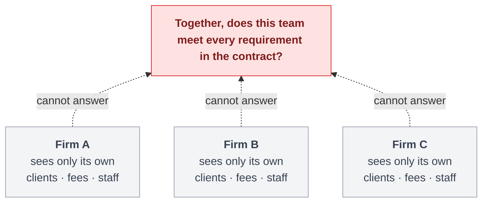
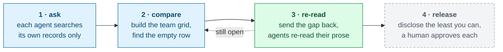
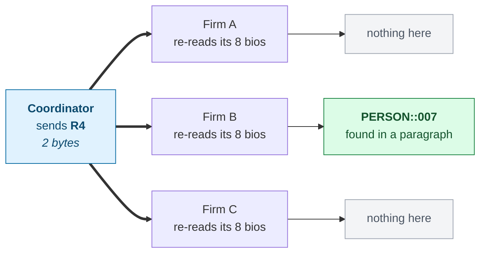

# Consortium

<div class="mt-6 text-2xl leading-relaxed">
Three firms have to prove their joint bid qualifies.<br>
None of them will show the others their data.
</div>

<div class="mt-10 text-lg opacity-80">
This is the protocol that settles it. No record moves.
</div>

<div class="mt-14 text-sm opacity-50">
Track 1 — SuperGrid &nbsp;·&nbsp; <code>flwr chat</code> → <code>@i53n1/consortium</code>
</div>

<!--
Read the two lines and stop. Everything else is on the next slide as a picture.

The through-line, said here and again at the end: the bidding form is the example, the
harness is the product.
-->

---
layout: center
class: text-left
---

# One contract. Three firms. Nobody can check.



<div class="cap mt-2">

Work too big for one firm gets bid by three. The client wants one proof that the
**whole team** qualifies. They compete against each other next month, and today that proof is
assembled by emailing spreadsheets.

</div>

<!--
Impact axis, and the slide that has to land. Say it in the judge's own language: a hospital,
a tunnel, an airport - too big for one firm, so three of them bid it as a team.

The tension in one sentence: to prove the team qualifies they would each have to hand over the
client list, the fee history and the staff roster they are about to compete with.

Do not say "joint venture", "solicitation" or "SF330" yet. None of those words earn anything
in the first minute.
-->

---
layout: center
class: text-left
---

# Five of six, at every firm

<div class="grid grid-cols-[20rem_4.5rem_4.5rem_4.5rem] gap-x-3 gap-y-1 text-sm mt-4">

<div></div>
<div class="text-center text-xs font-bold opacity-60">Firm A</div>
<div class="text-center text-xs font-bold opacity-60">Firm B</div>
<div class="text-center text-xs font-bold opacity-60">Firm C</div>

<div>Hospital projects over $50m</div>
<div class="ok">✓</div><div class="ok">✓</div><div class="ok">✓</div>

<div>Design-build, federal client</div>
<div class="ok">✓</div><div class="ok">✓</div><div class="ok">✓</div>

<div>Project manager with hospital work</div>
<div class="ok">✓</div><div class="ok">✓</div><div class="ok">✓</div>

<div class="font-bold">One person: hospital <i>and</i> earthquake retrofit</div>
<div class="no">✗</div><div class="no">✗</div><div class="no">✗</div>

<div>Chartered structural lead</div>
<div class="ok">✓</div><div class="ok">✓</div><div class="ok">✓</div>

<div>Green-certified projects</div>
<div class="ok">✓</div><div class="ok">✓</div><div class="ok">✓</div>

</div>

<div v-click class="cap mt-5">

Every firm looks like a fine partner. The fourth row is empty at all three of them, so the
team is not qualified and no firm can find that out alone.

</div>

<!--
This is the design constraint. The corpora are built backwards from this grid.

Careful with the wording: it is NOT "each firm thinks it is fine and is wrong". Every firm
genuinely misses the fourth row, because no firm's database fields describe it. Verified off
the run - round 1 has have=0 on that row and every firm alone clears the other five.
-->

---
layout: center
class: text-left
---

# The fourth row is in a paragraph, not a field

<div class="grid grid-cols-2 gap-6 mt-3">
<div>

### what the form asks for

<div class="tile">
The <b style="display:inline">same named person</b> on a hospital project <i>and</i> on an
earthquake-strengthening project. Both projects named.
<div class="mt-2 opacity-60">SF330 Section G — the person-by-project grid on the US federal form every bid team files.</div>
</div>

</div>
<div v-click>

### what firm B's database says

```text
person   FIRM_B::PERSON::007
role     structural lead
sector   civic          <- not healthcare
```

<div class="mt-2 text-xs opacity-70">what the person's written bio says:</div>

<div class="tile mt-1">
"… <b style="display:inline">seismic</b> base isolation and strengthening on an
<b style="display:inline">acute care wing</b> upgrade …"
</div>

</div>
</div>

<div v-click class="cap mt-4">

The fields say civic, so no keyword search reaches it. The prose says hospital. Firm B has the
answer, does not know it is the answer, and has no reason to go looking.

</div>

<!--
The crux for anyone outside construction. Two glosses, ten seconds: seismic means earthquake,
and a retrofit is strengthening a building that already exists.

Why it was filed as civic: a structural engineering firm saw a concrete frame and a city
client, not a hospital. That is an ordinary filing decision, not a contrived one.
-->

---
layout: center
class: text-left
---

# The loop



<div class="cap mt-3">

Stages 1–3 run today. Stage 4 is the dashed box: designed, specified, not built.
Nothing in the loop is about construction. The domain enters through three pluggable pieces: a
requirement list, a fixed vocabulary, and a cost per disclosure.

</div>

<!--
Innovation axis, and the answer to "isn't this just federated retrieval?" Retrieval settles
what exists. This settles what to reveal, and it broadcasts the question rather than the
answer.

Be straight about the dashed box. A judge who catches an overclaim stops believing the rest.
-->

---
layout: center
class: text-left
---

# Architecture

<div class="coordinator">
<b>Coordinator</b>builds the team grid &nbsp;·&nbsp; names the gap &nbsp;·&nbsp; never sees a record
</div>

<div class="flex justify-center gap-14 my-2 text-xs opacity-70">
<div>↓ &nbsp;the requirements, and the gap</div>
<div>↑ &nbsp;banded answers, nothing else</div>
</div>

<div class="boundary">trust boundary</div>

<div class="grid grid-cols-3 gap-4 mt-3">

<div class="firm">
<b>Firm A · SuperNode</b>
<div class="step">private library<div class="opacity-60">projects · people · clients · fees</div></div>
<div class="arrow">↓</div>
<div class="step">agent: match · re-read</div>
<div class="arrow">↓</div>
<div class="step">band to a fixed vocabulary</div>
</div>

<div class="firm">
<b>Firm B · SuperNode</b>
<div class="step">private library<div class="opacity-60">projects · people · clients · fees</div></div>
<div class="arrow">↓</div>
<div class="step">agent: match · re-read</div>
<div class="arrow">↓</div>
<div class="step">band to a fixed vocabulary</div>
</div>

<div class="firm">
<b>Firm C · SuperNode</b>
<div class="step">private library<div class="opacity-60">projects · people · clients · fees</div></div>
<div class="arrow">↓</div>
<div class="step">agent: match · re-read</div>
<div class="arrow">↓</div>
<div class="step">band to a fixed vocabulary</div>
</div>

</div>

<div class="cap mt-4">

Three identical stacks, on purpose. A library never leaves its own node. What crosses the
boundary is a handle and a band: `FIRM_B::PERSON::007`, `sector=civic`, `value=50-100M`. The
message has no field that could carry a name, a client or a fee.

</div>

<style>
.coordinator {
  background: #e0f2fe;
  color: #0c4a6e;
  border: 1px solid #7dd3fc;
  border-radius: 0.4rem;
  padding: 0.55rem;
  text-align: center;
  font-size: 0.78rem;
}
.coordinator b { display: block; font-size: 0.9rem; }
.boundary {
  display: flex;
  align-items: center;
  gap: 0.7rem;
  font-size: 0.6rem;
  letter-spacing: 0.12em;
  text-transform: uppercase;
  opacity: 0.5;
}
.boundary::before, .boundary::after {
  content: "";
  flex: 1;
  border-top: 2px dashed currentColor;
}
.firm {
  border: 1px solid #d9a441;
  background: #fffbeb;
  border-radius: 0.4rem;
  padding: 0.5rem;
  text-align: center;
  color: #78350f;
}
html.dark .firm { background: #241d12; border-color: #a16207; color: #fcd34d; }
.firm b { display: block; font-size: 0.76rem; margin-bottom: 0.35rem; }
.step {
  background: #fef3c7;
  border-radius: 0.25rem;
  padding: 0.22rem 0.3rem;
  font-size: 0.66rem;
  line-height: 1.3;
}
html.dark .step { background: #3d3218; color: #fde68a; }
.arrow { font-size: 0.6rem; opacity: 0.5; line-height: 1.3; }
</style>

<!--
Use of Flower, plus Safety. The three firm stacks are drawn identically on purpose - that is
the harness claim as a picture.

If they push on centralisation: the coordinator sees banded yes/no answers, the same
relationship that gradients have to training data.
-->

---
layout: center
class: text-left
---

# The coordinator sends the gap, not the answer



<div class="cap mt-3">

Firm B's agent went looking only because it was told about a hole in **somebody else's**
coverage. That is the whole argument: one agent answers a question none of them could ask
alone.

</div>

<!--
The beat. Hold here for as long as the question takes.

The line the log actually prints:
  firm B  R4 <- FIRM_B::PERSON::007 - prose details seismic base isolation
          and strengthening on an acute care wing upgrade

Two bytes is the literal payload: the string "R4". Not which firm has the hole, not what would
fill it. The model reads Firm B's bios on Firm B's node; the sentence it reasons over never
leaves.
-->

---
layout: center
class: text-left
---

# What crossed the wire

<div class="grid grid-cols-4 gap-4 mt-6 text-center">
<div><div class="num">2</div><div class="numlabel">rounds to converge</div></div>
<div><div class="num">2 B</div><div class="numlabel">the gap, broadcast back</div></div>
<div><div class="num">32.4 kB</div><div class="numlabel">banded answers, forward</div></div>
<div><div class="num text-green-600">0 B</div><div class="numlabel">record content, either way</div></div>
</div>

<div class="cap mt-8">

Zero is structural: the message format has no field that can carry a record. Nothing is
disclosed until a human releases a handle.

</div>

<div v-click class="cap mt-4">

Model answers are cached on disk, so a rehearsed run replays exactly and a dead endpoint costs
nothing. Two invariant tests guard the vocabulary and the engineered gap.

</div>

<!--
Technical execution axis. Every number here was read off the run in
frontend/state/trace-healthcare-seismic.jsonl - round 1 attests 19, 13 and 18; the round-2
broadcast carries gap_bytes 2; banded_bytes 33191, which the page prints as 32.4 kB;
record_bytes 0; converged after 2 rounds.

If a judge wants to see it again, press Run.
-->

---
layout: center
class: text-left
---

# Safety by construction

<div class="grid grid-cols-2 gap-4 mt-4">

<div class="tile"><b>A fixed vocabulary on the way out</b>
Exact fees and dates become ranges before anything leaves the node.</div>

<div class="tile"><b>Reject, never scrub</b>
An unknown field is an error. A filter that quietly deletes teaches an agent that leaky output
is fine.</div>

<div class="tile"><b>Reading stays home</b>
The model reads a firm's own paragraphs on the firm's own node.</div>

<div class="tile"><b>A refusal cannot be walked around</b>
Blocked records never enter the candidate set, so nothing downstream can pick one.</div>

</div>

<div v-click class="cap mt-5">

No firm can assert anything about another firm. And the coordinator can prove the team
qualifies, or does not, **before a single record is disclosed**.

</div>

<!--
A scored axis, not a compliance chore: the organisers weight transparency, reliability and
supervision, and say agent performance is not the deciding factor. So raise it deliberately.

Do not offer a rejection count or an approval count. Nothing counts them, and the human gate
is roadmap.
-->

---
layout: center
class: text-left
---

# One protocol, three wires

<div class="grid grid-cols-3 gap-4 mt-5">
<div class="tile"><b><code>LocalGrid</code></b>The published <b style="display:inline">AgentApp</b>, in process. What a judge gets from <code>flwr chat</code>.</div>
<div class="tile"><b><code>InMemoryGrid</code></b>Simulation runtime. Three SuperNodes, real per-node data isolation. The table demo.</div>
<div class="tile"><b><code>GrpcGrid</code></b>A real SuperLink. Same <code>send_and_receive</code>, same <code>Message(QUERY)</code>.</div>
</div>

<div class="cap mt-6">

No code changes between them, and the demo's log names which one is carrying the messages.
A node knows whether it is simulated or real from its own `node_config`, and no coordinator
gets to redirect that.

</div>

<div class="cap mt-4">

Published: **`flower.ai/apps/i53n1/consortium`** &nbsp;·&nbsp; `flwr chat` → `@i53n1/consortium`

</div>

<!--
Use of Flower axis. The honest answer to "does it really run on SuperGrid": it is published
and invokable. We drive the table demo locally because 130 people share the wifi, not because
the deployment path is a mock.

Every model call goes through agent.responses.create, the Open Responses shape.
-->

---
layout: center
class: text-left
---

# The form is the example. The harness is the product.

<div class="grid grid-cols-2 gap-4 mt-4">

<div class="tile"><b><span class="float-right">Firm B</span>Hospital in an earthquake zone</b>
A hospital wing filed as civic work</div>

<div class="tile"><b><span class="float-right">Firm C</span>Transit station and tunnel</b>
A bore under a live platform, billed as a relief conduit</div>

<div class="tile"><b><span class="float-right">Firm A</span>Secure research laboratory</b>
A containment suite booked to the client who paid for it</div>

<div class="tile"><b><span class="float-right">Firm B</span>Campus energy retrofit</b>
An energy centre bought by the city, serving the university</div>

</div>

<div v-click class="cap mt-5">

Same protocol, same code, no per-scenario branches. The hidden row moves, and the harness does
not know where. Swap the three pluggable pieces and the loop runs for hospitals sizing a trial
cohort without sharing patients, or banks checking one name against each other's alerts.

</div>

<!--
Innovation and Impact together. This is the slide that turns "an app" into "a harness".

At the table, use the live scenario selector instead - it costs eight seconds and lands harder
than the tiles do.
-->

---
layout: center
class: text-left
---

# Roadmap

<div class="grid grid-cols-2 gap-4 mt-5">

<div class="tile" style="border-left: 4px solid #60a5fa">
<b>1 · Disclose as little as possible</b>
Clear every requirement at the lowest total disclosure cost.</div>

<div class="tile" style="border-left: 4px solid #60a5fa">
<b>2 · A named human approves each record</b>
A refusal makes the plan find the next-cheapest substitute.</div>

<div class="tile" style="border-left: 4px solid #9ca3af">
<b>3 · Measure it against a central pool</b>
Match what one pooled database finds, at a fraction of the disclosure.</div>

<div class="tile" style="border-left: 4px solid #22c55e">
<b>4 · Learn from who actually wins</b>
A shared win-rate model over past bids, with no bid history exposed.</div>

</div>

<!--
Items 1-3 are today's cut list, in order.

1 is greedy weighted set cover, inside the form's limit of ten example projects: deterministic
and explainable. 2 routes each request to a named owner at the firm that holds the record, and
the refusal is honoured rather than routed around. 3 is the claim to try to break.

Item 4 is the one to say out loud if there is time for exactly one: every finished bid is a
labelled example of which evidence won, so firms can federate a win-rate prior over
requirement-to-evidence matching. Federated learning in a market where nobody will ever pool
the data. That is why the harness is worth more than the demo.
-->

---
layout: center
class: text-center
---

# The form is the example. The harness is the product.

<div class="mt-8 text-xl opacity-85">
ask &nbsp;→&nbsp; find what nobody covers &nbsp;→&nbsp; re-read locally against it &nbsp;→&nbsp; release the least you can
</div>

<div class="mt-12 text-lg">
A protocol for agents that are not allowed to pool their data.
</div>

<div class="mt-14 text-sm opacity-50">
<code>@i53n1/consortium</code> &nbsp;·&nbsp; Apache-2.0 &nbsp;·&nbsp; Track 1 — SuperGrid
</div>

<!--
Stop talking. Four minutes of a five-minute slot, and the questions are where the marks are.
-->

---
layout: center
class: text-left
---

# Appendix — the six axes

<div class="text-xs">

| Axis | What evidences it | Slide |
|---|---|---|
| **Impact** | Teams of firms bid public work by emailing spreadsheets; this is the missing primitive | 2, 12 |
| **Innovation** | Broadcast the *gap*, not the answer, so an agent answers a question it could not ask | 5, 7 |
| **Use of Flower** | Real `AgentApp` on Hub; one protocol over three `Grid`s; runtime chosen by `node_config` | 10 |
| **Technical execution** | Runs end to end, converges in 2 rounds, four scenarios, replays offline, invariant tests | 8 |
| **Demo and delivery** | Split screen: the protocol's own log beside a live picture of the same run | live |
| **Safety and oversight** | Fixed egress vocabulary, reject-not-scrub, reading stays on the node, 0 B by construction | 9 |

</div>

<div class="cap mt-4">

**Not claimed:** a disclosure count, a denial, a live substitution, an assembled form, a human
approval gate, a rejection count, or the central-pool baseline. Those are slide 12, and saying
so is why the rest holds up under a follow-up question.

</div>

<!--
Not presented. This is for the rehearsal, and for the judge who asks how we score ourselves -
which happens more often than you would think.
-->
