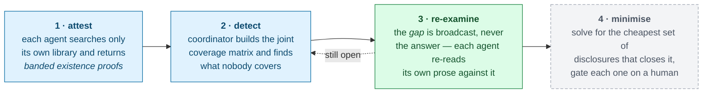
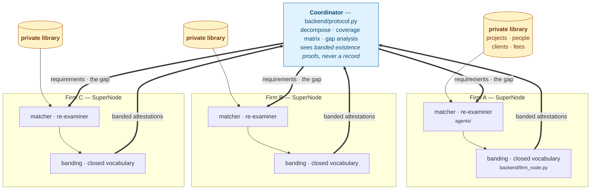

# Consortium

## A collaborative disclosure harness for Flower Agents

<div class="mt-8 text-xl opacity-80">
Three firms discover their joint bid is non-compliant, fix it,<br>
and never let a record leave the building.
</div>

<div class="mt-12 text-sm opacity-60">
Track 1 — SuperGrid &nbsp;·&nbsp; <code>flwr chat</code> → <code>@i53n1/consortium</code>
</div>

<!--
Say the harness sentence once here and once at the end: "the SF330 is the example;
the harness is the product." On stage it is the only thing anyone remembers.
-->

---
layout: center
class: text-left
---

# The business problem

Large federal infrastructure is bid by **joint ventures** — three or four firms partner on one
pursuit, each contributing project qualifications and key personnel.

<div v-click class="mt-6">

Those same firms **compete against each other on the next three pursuits.**

</div>

<div v-click class="mt-6">

To submit, the partners must prove **together** that the team covers every requirement in the
solicitation. But a firm's project history exposes its client relationships and its contract
values, and its roster is a recruiter's shopping list.

</div>

<div v-click class="mt-8 p-4 border-l-4 border-red-400 bg-red-50 dark:bg-red-900 dark:bg-opacity-20">

Today this is done by **emailing spreadsheets around and hoping.**

</div>

<!--
Impact axis. Keep it in the judge's language — no SF330 yet, no architecture. If the room is
UK-heavy, ten seconds later: "US federal qualifications form, Section G is a person-by-project
matrix." Do not explain more than that.
-->

---
layout: center
class: text-left
---

# Why nobody can just check

The form asks for a **matrix**, not a list. Not "the team has healthcare people and seismic
people" — *this named individual, on that named project.*

<div class="grid grid-cols-3 gap-4 mt-8 text-sm">
<div v-click class="p-4 rounded bg-gray-100 dark:bg-gray-800">
<div class="font-bold">Firm A</div>
<div class="opacity-70 mt-2">Has healthcare people.<br>Has seismic people.<br><b>Nobody who is both.</b></div>
</div>
<div v-click class="p-4 rounded bg-gray-100 dark:bg-gray-800">
<div class="font-bold">Firm B</div>
<div class="opacity-70 mt-2">Has exactly one such person — on a hospital wing it filed as <b>civic work</b>.</div>
</div>
<div v-click class="p-4 rounded bg-gray-100 dark:bg-gray-800">
<div class="font-bold">Firm C</div>
<div class="opacity-70 mt-2">Strong federal past performance. Not this cell.</div>
</div>
</div>

<div v-click class="mt-8">

Each firm covers **five of six** requirements on its own, so each looks like a fine partner.
The sixth is invisible to structured search **at every one of them** — it only exists in a bio.

**No single firm can assess whether the joint venture is compliant.** If one could, the system
did not need to be distributed.

</div>

<!--
This is the design constraint, and the corpora are engineered backwards from it.

Do NOT say "every firm self-assesses compliant and is confidently wrong" — the run does not
show that. Every firm misses R4, because no firm's declared fields describe it. The correction
is the stronger claim: it takes the joint matrix to license the local re-read.
-->

---
layout: center
class: text-left
---

# The harness

A protocol for agents that are **not allowed to pool their data.**



<div class="grid grid-cols-2 gap-8 mt-4 text-sm">
<div>

Nothing in that loop is about architecture firms. The domain enters through **three pluggable
pieces**: a requirement set, a closed banding vocabulary, and a disclosure-cost function.

</div>
<div>

Stages 1–3 run today. Stage 4 is designed and not built — the dashed box, and the roadmap
slide.

</div>
</div>

<!--
Innovation axis, and the answer to "isn't this federated RAG?" — retrieval establishes what
exists; this decides what to reveal. Be straight about stage 4 being the dashed box; a judge
who catches you overclaiming stops believing the rest.
-->

---
layout: center
class: text-left
---

# Architecture



<div class="text-sm mt-2 opacity-80">

The library never crosses its own node boundary. What crosses is a **handle and a band** —
`FIRM_B::PERSON::007`, `sector=civic`, `value_band=50-100M`. A struct that structurally cannot
carry a client name, a fee, or a person.

</div>

<!--
Use of Flower + Safety. The three firm stacks are identical on purpose — that is the harness
claim in a picture. If they push on centralisation: the coordinator sees banded existence
proofs, the same relationship gradients have to training data.
-->

---
layout: center
class: text-left
---

# Round 2 is the whole argument

<div class="grid grid-cols-2 gap-10 mt-4">
<div>

### What the coordinator sends

**`R4`. Two bytes.**

Not which firm has the hole. Not what would fill it. Not a record, a name, or a hint.

<div v-click class="mt-6">

### What each agent then does

Re-reads **its own** eight bios with a model **on its own node**, asking a question it could
not have posed in round 1.

Firm A: *nothing here evidences it.*
Firm C: *nothing here evidences it.*

</div>
</div>
<div>

<div v-click>

### What Firm B finds

```text
firm B  gap R4 - re-reading 8 records
firm B  R4 <- FIRM_B::PERSON::007
        prose details seismic base isolation
        and strengthening on an acute care
        wing upgrade project
```

Filed as civic work. Only the bio says the building was a hospital.

</div>

<div v-click class="mt-6 p-4 border-l-4 border-green-500 bg-green-50 dark:bg-green-900 dark:bg-opacity-20">

Firm B's agent only looked because it was told about a hole in **somebody else's** coverage.

That is the multiplier. Not three agents working faster — one agent answering a question none
of them could pose alone.

</div>
</div>
</div>

<!--
This is the beat. The information that unlocks the search is held by a party that cannot see
the data the search runs over. Hold here for as long as the question takes.

The model's reasoning stays on the node — what crossed the wire was requirement-side
vocabulary, not the sentence.
-->

---
layout: center
class: text-left
---

# What actually ran

<div class="grid grid-cols-2 gap-8 text-sm">
<div>

| | |
|---|---|
| requirements decomposed | **6** typed |
| firms | **3** SuperNodes, one process each |
| round 1 attestations | **19 · 13 · 18** |
| round 1 verdict | **R4 uncovered** — non-compliant |
| the gap broadcast back | **2 bytes** |
| round 2 | Firm B closes R4 |
| rounds to converge | **2** — it stops early |
| banded on the wire | **32.4 kB** forward |
| **record content on the wire** | **0 B** |

</div>
<div>

Zero is **by construction, not by policy** — the protocol has no field that can carry a
record. It stays zero until a human releases a handle.

<div v-click class="mt-6">

The run is **deterministic and offline.** Model responses are cached on disk, so a rehearsed
run replays byte for byte and the demo survives a dead endpoint. The pane prints
`(from cache)` when that happens, rather than hiding it.

</div>

<div v-click class="mt-6">

**Invariant tests** guard the two things that break silently: the vocabulary drifting from the
schema, and a corpus edit that closes the engineered gap.

</div>
</div>
</div>

<!--
Technical execution axis. Everything on this slide is copied off a real run — if a judge asks
to see it again, press Run.
-->

---
layout: center
class: text-left
---

# Safety and oversight

<div class="grid grid-cols-2 gap-8 mt-4 text-sm">

<div class="p-4 rounded bg-gray-100 dark:bg-gray-800">
<div class="font-bold">Banded egress, closed vocabulary</div>
<div class="opacity-75 mt-2">Every field is reduced to a value from a closed set before it leaves the node. Exact contract values become bands; exact dates become ranges.</div>
</div>

<div class="p-4 rounded bg-gray-100 dark:bg-gray-800">
<div class="font-bold">Reject, do not sanitise</div>
<div class="opacity-75 mt-2">An unknown key is an error, not something dropped quietly. A sanitising filter teaches an agent that leaky output is acceptable and ships whatever the regex missed.</div>
</div>

<div class="p-4 rounded bg-gray-100 dark:bg-gray-800">
<div class="font-bold">Reasoning stays on the node</div>
<div class="opacity-75 mt-2">Round 2's model reads a firm's own bios locally. What crosses the wire is requirement-side vocabulary — never the model's sentence about a record.</div>
</div>

<div class="p-4 rounded bg-gray-100 dark:bg-gray-800">
<div class="font-bold">A refusal cannot be routed around</div>
<div class="opacity-75 mt-2">Records marked blocked never enter the candidate set, so no downstream step can select one. The agent never even offers it.</div>
</div>

</div>

<div v-click class="mt-6 p-4 border-l-4 border-blue-400 text-sm">

A firm cannot assert facts about another firm — links are restricted to same-firm handles. And
the coordinator can prove compliance or non-compliance **before any record is disclosed at all.**

</div>

<!--
Safety is a scored axis, not a compliance chore. The organisers weight transparency,
reliability and appropriate supervision — and note that agent performance is not the decisive
factor. Surface this deliberately.

Do NOT quote a rejection count or an approval count: there is no instrumented counter, and the
human gate is roadmap.
-->

---
layout: center
class: text-left
---

# Flower and SuperGrid

<div class="text-sm">

One protocol, parameterised by a `Grid`. **Three wires, no code change** — the demo's left
pane names which one is carrying the messages, so we never imply a SuperLink we are not using.

</div>

<div class="grid grid-cols-3 gap-4 mt-6 text-sm">
<div class="p-4 rounded bg-gray-100 dark:bg-gray-800">
<code class="font-bold">LocalGrid</code>
<div class="opacity-75 mt-2">The published <b>AgentApp</b>, in process. This is what a judge invokes from <code>flwr chat</code>.</div>
</div>
<div class="p-4 rounded bg-gray-100 dark:bg-gray-800">
<code class="font-bold">InMemoryGrid</code>
<div class="opacity-75 mt-2">The simulation runtime, three SuperNodes with genuine per-node data isolation. The table demo.</div>
</div>
<div class="p-4 rounded bg-gray-100 dark:bg-gray-800">
<code class="font-bold">GrpcGrid</code>
<div class="opacity-75 mt-2">A real SuperLink. Same <code>send_and_receive</code>, same <code>Message(QUERY)</code>.</div>
</div>
</div>

<div class="grid grid-cols-2 gap-8 mt-8 text-sm">
<div>

Dual-runtime by `node_config`, as Hub requires: a simulated node carries `partition-id`, a
real one carries its own `library-path` — and **no coordinator gets to redirect that.**

Every model call goes through `agent.responses.create`, the Open Responses shape.

</div>
<div>

**Published:** `flower.ai/apps/i53n1/consortium`

```bash
flwr login supergrid
flwr chat        # @i53n1/consortium <solicitation>
```

Hub keeps only `.py .toml .md .json`, so the shipped output surface is what Python prints —
the HTML is a local skin over the same trace.

</div>
</div>

<!--
Use of Flower axis. The honest framing on "does it really run on SuperGrid": it is published
and invokable; we drive the table demo locally because 130 people are on the same wifi, not
because the deployment path is a mock.
-->

---
layout: center
class: text-left
---

# The SF330 is the example. The harness is the product.

Four solicitations. **Same protocol, same code, no per-scenario branches.** The gap sits at a
different firm in each, and the harness does not know which.

<div class="mt-6 text-sm">

| Solicitation | The hidden cell | Gap held by |
|---|---|---|
| Federal healthcare facility, seismic zone | A hospital wing filed as civic work by a structural firm | **Firm B** |
| Transit station box and running tunnel | A bore beneath a live platform, billed as a relief conduit | **Firm C** |
| Secure research laboratory on an active installation | A containment suite booked to the pharma client who paid for it | **Firm A** |
| Campus decarbonisation and deep energy retrofit | An energy centre procured by the city, serving the university | **Firm B** |

</div>

<div v-click class="mt-6">

Swap the three pluggable pieces and the same loop runs **cross-hospital cohort feasibility**,
**cross-bank sanctions triage**, or **supply-chain conformance** — any set of parties who must
jointly prove a property none can verify alone and cannot pool data to check.

That separation is why this belongs on Hub rather than in a repo.

</div>

<!--
Innovation + Impact. This is the slide that turns "an app" into "a harness" in a judge's head.
At the table, use the live scenario selector instead — it costs eight seconds and lands harder.
-->

---
layout: center
class: text-left
---

# Roadmap

<div class="text-sm opacity-70 mt-2">Next, in order. The first item is designed, specified, and deliberately not built today.</div>

<div class="mt-6 space-y-4 text-sm">

<div class="p-4 rounded border-l-4 border-blue-400 bg-gray-100 dark:bg-gray-800">
<div class="font-bold">1 · Minimum-disclosure optimiser</div>
<div class="opacity-80 mt-1">Greedy weighted set cover: minimise total disclosure cost subject to every mandatory requirement being covered, under the form's hard cap of ten example projects. Deterministic and explainable — <b>compliance achieved, disclosure minimised</b>, and you win on both axes.</div>
</div>

<div class="p-4 rounded border-l-4 border-blue-400 bg-gray-100 dark:bg-gray-800">
<div class="font-bold">2 · Per-record human authorisation</div>
<div class="opacity-80 mt-1">Each disclosure request routes to a named owner at the firm that holds it. A denial makes the optimiser <b>re-plan</b> and find the next-cheapest substitute — the refusal is honoured, not routed around. Every released record carries an approver.</div>
</div>

<div class="p-4 rounded border-l-4 border-gray-400 bg-gray-100 dark:bg-gray-800">
<div class="font-bold">3 · The three-condition evaluation</div>
<div class="opacity-80 mt-1">Isolated self-assessment vs. federated consortium vs. a centralised pool of all libraries. The claim to falsify: <b>match the centralised oracle's compliance at a fraction of the disclosure.</b></div>
</div>

<div v-click class="p-4 rounded border-l-4 border-green-500 bg-green-50 dark:bg-green-900 dark:bg-opacity-20">
<div class="font-bold">4 · Federated learning over commercial outcomes</div>
<div class="opacity-80 mt-1">Every completed pursuit is a labelled example: this evidence set, against this solicitation, won or lost. Firms federate a <b>win-rate prior</b> over requirement-to-evidence matching — learning which qualification patterns actually convert — without any firm exposing its bid history or its losses. Federated learning in a market where nobody will ever pool the data.</div>
</div>

</div>

<!--
Items 1–3 are this afternoon's cut list, in order. Item 4 is the one to say out loud if there
is time for exactly one: it is the reason the harness is worth more than the demo, and it is a
product someone could plausibly ship.
-->

---
layout: center
class: text-center
---

# Consortium

<div class="text-xl mt-6 opacity-90">
A harness for agents that are not allowed to pool their data.
</div>

<div class="mt-10 text-lg">
attest &nbsp;→&nbsp; detect the gap &nbsp;→&nbsp; re-examine locally against it &nbsp;→&nbsp; minimise disclosure
</div>

<div class="mt-10 text-2xl font-bold">
The SF330 is the example. The harness is the product.
</div>

<div class="mt-12 text-sm opacity-60">
Track 1 — SuperGrid &nbsp;·&nbsp; <code>@i53n1/consortium</code> &nbsp;·&nbsp; Apache-2.0
</div>

<!--
Stop talking here. Four minutes of a five-minute slot; the last minute is theirs, and the
judges' questions are where the marks actually are. Brief §13 is the Q&A prep.
-->

---
layout: center
class: text-left
---

# Appendix — the six axes

<div class="text-sm">

| Axis | What evidences it | Slide |
|---|---|---|
| **Impact** | Joint ventures bid federal work by emailing spreadsheets; this is the missing primitive | 2, 11 |
| **Innovation** | Not retrieval — broadcast the *gap*, not the answer, so an agent answers a question it could not pose | 4, 7 |
| **Use of Flower** | Genuine `AgentApp` published to Hub; one protocol over three `Grid`s; dual-runtime by `node_config` | 10 |
| **Technical execution** | Runs end to end, converges in 2 rounds, four scenarios, deterministic and offline, invariant tests | 8, 11 |
| **Demo and delivery** | Split screen: the protocol's own log beside a live visualisation of the same run, driven from the page | live |
| **Safety and oversight** | Banded egress over a closed vocabulary, reject-not-sanitise, reasoning stays on the node, 0 B by construction | 9 |

</div>

<div class="mt-6 text-sm opacity-75">

**Not claimed:** a disclosure count, a denial, a live substitution, an assembled SF330, a
human approval gate, a bander rejection count, or the centralised-pool baseline. Those are the
roadmap slide, and saying so is why the rest holds up under a follow-up question.

</div>

<!--
Do not present this slide. It is for the rehearsal, and for the moment a judge asks "how does
this score against your own criteria" — which happens more often than you would think.
-->
